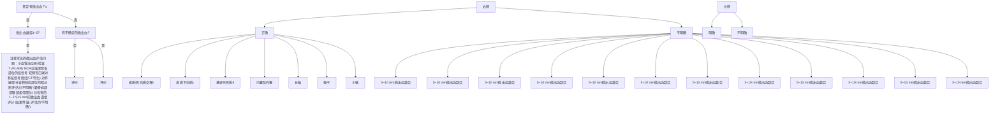

·指南·

# 中国脑小血管病诊治指南2020

中华医学会神经病学分会 中华医学会神经病学分会脑血管病学组

通信作者：黄一宁，北京大学第一医院神经内科，北京 100034，Email：ynhuang@bjmu.edu.cn；刘鸣，四川大学华西医院神经内科，成都 610041，Email：wyplmh@hotmail.com；蒲传强，解放军总医院神经内科，北京 100853，Email：pucq30128@sina.cn；崔丽英，中国医学科学院北京协和医院神经科，北京 100730，Email：pumchcuily@sina.com

【摘要】 脑小血管病是指各种病因影响脑内小动脉、微动脉、毛细血管、微静脉和小静脉所导致的一系列临床、影像、病理综合征。脑小血管病的诊断主要依靠神经影像学，其主要影像学表现为近期皮质下小梗死、腔隙性脑梗死、脑出血、皮质下白质病变、皮质表面铁沉积、脑微出血和微梗死。根据病因可将其分为小动脉硬化、散发性或遗传性脑淀粉样血管病、其他遗传性脑小血管病、炎性或免疫介导性脑小血管病、静脉胶原化疾病和其他脑小血管病共 类。控制血压是预防年龄相关的脑小血管病发生和发展最有效的方法。目前没有足够证据证实抗血小板药物在治疗缺血性脑小血管病与动脉粥样硬化大血管病之间的疗效存在显著差异，但在使用抗血小板药物前，应该进行脑出血的风险评估。

【关键词】 脑小血管病； 指南； 中国

# Chinese guideline for diagnosis and treatment of cerebral small vessel disease 2020

Chinese Society of Neurology, Chinese Stroke Society

Corresponding authors: Huang Yining, Department of Neurology, Peking University First Hospital, Beijing 100034, China, Email: ynhuang@bjmu.edu.cn; Liu Ming, Department of Neurology, West China Hospital, Sichuan University, Chengdu 610041, China, Email: wyplmh@hotmail. com; Pu Chuanqiang, Department of Neurology, Chinese People′s Liberation Army General Hospital, Beijing 100853, China, Email: pucq30128@sina. cn; Cui Liying, Department of Neurology, Peking Union Medical College Hospital, Chinese Academy of Medical Sciences, Beijing 100730, China, Email: pumchcuily@sina.com

【Abstract】 Cerebral small vessel disease (CSVD) refers to a series of clinical, imaging, and pathological syndromes caused by various etiologies affecting cerebral small arteries, arterioles, capillaries, venules, and small veins. The diagnosis of CSVD mainly depends on neuroimaging, which mainly manifests as recent small subcortical infarcts, lacunar cerebral infarcts, cerebral hemorrhage, subcortical white matter lesions, iron deposits on the cortical surface, cerebral microbleeds, and microinfarcts. According to its etiologies, it could be divided into 6 groups including arteriolosclerosis, sporadic or inherited cerebral amyloid angiopathy, other inherited small vascular diseases, inflammatory and immunologically mediated small vessel diseases, venous collagenosis, and other small vessel diseases. Blood pressure control is the most effective method to prevent the occurrence and development of age‐related CSVD. At present, there is insufficient evidence to confirm a significant difference of antiplatelet drugs in the treatment of ischemic CSVD and atherosclerotic large vascular disease, and a risk assessment of cerebral hemorrhage should be completed before the use of antiplatelet drugs.

【Key words】 Cerebral small vessel disease; Guideline; China

Conflicts of interest: None declared

近年，随着对人群和脑卒中患者的深入研究，对脑小血管病认识不断扩展，知识日新月异。自2015年第一个脑小血管病专家共识［1］ 发布以来，很多知识已经加深和扩展。为此，我们在原有版本基础上进行了较大幅度的改动，现予以发布。

# 脑小血管病定义

脑小血管病是指各种病因影响脑内小动脉、微动脉、毛细血管、微静脉和小静脉所导致的一系列临床、影像、病理综合征。主要影像学表现为近期皮质下小梗死、腔隙性脑梗死、脑出血、皮质下白质病变、皮质表面铁沉积、脑微出血和微梗死［2‑3］。

# 脑小血管病病因

按照脑小血管病的病因可将其分为 大类：（）小动脉硬化，也称年龄和血管危险因素相关性脑小血管病；（）散发性或遗传性脑淀粉样血管病；（）其他遗传性脑小血管病；（）炎性或免疫介导性脑小血管病；（）静脉胶原化疾病；（）其他脑小血管病［4］ 。

大血管动脉粥样硬化造成的颈部脑血管和颅内大的血管狭窄也可以合并年龄相关或高血压相关的脑小血管病［5‑6］ 。文中主要阐述第一和第二类脑小血管病。

# 流行病学资料

在我国，脑小血管病变所引起的腔隙性梗死占缺血性脑卒中的 ，而脑出血占所有类型脑卒中的 ，显著高于西方国家［7］ 。脑小血管病的发病率与年龄呈正相关。研究结果表明， 岁人群中 有脑白质病变； 岁的人群中，存在皮质下白质改变， 存在脑室周围白质改变；而在 岁的人群中， 存在皮质下白质改变， 存在脑室周围改变［8］ 。脑微出血在岁的人群中发生率约为 ，而在 岁人群中发生率可达36%［9］ 。脑小血管病引起的脑卒中复发率较大血管动脉粥样硬化引起的脑卒中复发率略低，年脑卒中复发率约为 ，其中 为脑出血， 痴呆患者是由脑小血管病所致［10］。

脑小血管病最常见的危险因素是血压大于 （ ）；其次是吸烟、 糖尿病、阻塞性睡眠呼吸暂停、慢性肾病、分支性动 脉粥样硬化伴皮质下卒中。淀粉样变性血管病在 老年人中也是常见的原因。

单基因病是少见的原因。最常见的是伴有皮质下梗死和白质脑病的常染色体显性遗传性脑动脉 病（cerebral autosomal dominant arteriopathy withsubcortical infarcts and leukoencephalopathy，）。另外，比较常见的有伴有皮质下梗死和白质脑病的常染色体隐性遗传性脑动脉病（cerebral autosomal recessive arteriopathy withsubcortical infarcts and leukoencephalopathy，）、法布里病（ ）等。

# 发病机制

脑小血管病常累及穿通动脉，病变血管直径小于 ［11］ 。病理变化是一个动态发展过程，最后 累 及 全 脑［12］。 磁 共 振 成 像（magnetic resonance， ）可以发现小血管病变导致的病理变化，穿过病变部位的白质纤维逆行坏死，导致远端皮质和脑干继发变性［13‑14］。

高血压、血管炎症或者遗传缺陷引起的血管内皮细胞损伤、平滑肌增生、小血管壁的基底膜增厚，造成管腔狭窄、闭塞或者扩张。这些小血管病变也可以发生在没有高血压的个体。血管平滑肌细胞丢失和增生、血管壁变厚、血管管腔狭窄，引起慢性、进行性的局部甚至是弥漫性亚临床缺血，神经细胞脱髓鞘、少突胶质细胞丢失、轴索损伤，造成不完全性缺血。此阶段没有临床症状，核磁共振检查显示为脑白质病变，提示这些病变不仅仅是血管堵塞造成梗死，还有更加复杂的因素参与。病灶可以超出小血管周围，内皮损伤后血管通透性增加导致血管内物质外渗，引起血管及血管周围组织损伤，毛细血管内皮细胞和周细胞与星形胶质细胞、少突细胞和小胶质细胞的互相作用，这种机制在疾病的进展中发挥着重要作用［15］。

疾病发展的下一步是血管壁损伤、微小动脉瘤形成或者淀粉样物质沉淀，局部发生炎性改变、血管壁破坏、血液成分渗出，显微镜下可见微出血，病灶大小为 ，常为多发，无临床症状。与高血压和年龄相关的微出血多发生在基底节部位和脑桥，而与淀粉样血管病相关的微出血则多分布于大脑和小脑的皮质区域。

脑的小血管病进一步发展可破坏血脑屏障，造成局部炎性反应，血管自动调节功能丧失，脑血流量下降，导致严重局部缺血，灰白质完全坏死，临床表 现 出 腔 隙 性 脑 梗 死 症 状。梗 死 病 灶 通 常<，称之为腔隙性脑梗死。表现为持久的白质高信号改变，表示脱髓鞘、轴索丢失、胶质化、坏死组织填充的腔隙状态。这些小血管病变变化可以是皱缩和消失或者增长［16‑17］ 。这些病灶最常发生在穿支动脉，分布在基底节区或者脑干部位。

微梗死在大体解剖中肉眼看不见，显微镜下可看到脑实质内微小的细胞丢失或组织坏死病灶，也可以观察到充满液体的空腔。

脑小血管病急性发作的另一类型是小血管破裂，引起脑出血，与高血压相关的脑出血多位于内囊、外囊、脑桥或者小脑半球。而与淀粉样血管病相关的小血管病出血则多分布在脑叶或小脑半球。

脑小血管病引起的腔隙梗死、脑出血、白质病变、微出血和微梗死可以共存在同一个体内。因此，脑小血管病患者同时具有易发缺血和出血两种趋势，可以在不同的时间段发生，也可以同时发生。比如在高血压脑出血患者中，约 同时在双侧大脑半球出现新鲜的微梗死灶。

# 脑小血管病临床表现

脑小血管病可以无临床症状。随着病变部位和范围扩大，常见的临床表现为急性腔隙性梗死引起的运动和感觉综合征，包括纯运动轻偏瘫、纯偏身感觉障碍、共济失调轻偏瘫、感觉运动卒中、构音障碍笨手综合征。也可以表现为特殊部位的急性皮质下梗死，累及内囊后肢、丘脑、豆状核、侧脑室体部外侧白质、脑桥等。脑小血管病急性发作表现为腔隙性脑梗死或者脑实质出血［18］。同时，患者的缺血性脑卒中复发风险增加，脑出血血肿容易扩大［19］ 。

慢性脑小血管病变主要依靠神经影像学诊断，表现为脑白质病变或者脑微出血。临床表现缺乏特异性，甚至没有症状。严重的脑白质病变可以引起认知功能下降以至血管性痴呆、抑郁、步态障碍、吞咽和排尿功能异常［20］ 。认知功能障碍以执行和注意功能下降为主要特征，记忆功能相对完整。近年一些研究结果显示脑小血管病变是老年性痴呆的主要原因之一［21］。

脑核磁共振检查发现脑白质高信号、微量出血、腔隙性梗死和弥散张量成像（diffusion tensorimaging，DTI）异常，20%\~50% 完全没有临床症状［22］ 。但是，5年内有18%\~20%会发生认知功能下降［23］ 。

# 脑小血管病影像学检查

脑小血管病的临床表现复杂多样，起病形式可急可缓，缺乏特异性。诊断主要靠实验室检查，包括脑小血管结构和功能检查。

# 一、MRI

MRI是目前检测脑小血管病最重要的工具。常规 检查序列应当包括：轴位弥散加权成像（diffusion weighted imaging，DWI）、T 液体衰减反转恢 复 序 列（fluid attenuated inversion recovery，FLAIR）、T \* 加 权 梯 度 回 波（gradient‑recalled echo，GRE）或 磁 敏 感 加 权 成 像（susceptibility weightedimaging，SWI）、T WI 和 T WI。1.5 T MRI 可以满足临床检查需要， 更优，可以显示微小梗死。

的标志性改变为新发小的皮质下梗死（ ）、腔隙、白质高信号 、血 管 周 围 间 隙（perivascular space）、微 出 血（ ）以及微梗死。此外，脑萎缩也被认为与脑小血管病有关。

# （一）新发小的皮质下微梗死

显示穿支动脉供血区的新发腔隙性梗死，引起相关临床症状。轴位切面显示急性期梗死直径小于 ，冠状位或矢状位可以超过 。对很小的病变也非常敏感，病灶直径没有下限。缺点是发病 周以上信号消退，时间分辨率有限。少数病例的 会出现假阴性结果。

在近期（ 个月）脑出血患者中， 患者中可以检查到小的 病变。淀粉样血管病有出现 微小病变。颈内动脉内膜剥脱术患者中有 ，认知障碍或痴呆患者中有 显示微小病变。

阅读 时应该注意病变的部位、大小、形状、数目、与症状是否相关以及进行影像学检查距发病的时间。轴位结合冠状位和矢状位评估有助于了解病变大小。

纹状体内囊部位常常出现多支穿通动脉区同时梗死，直径通常超过20 mm，这一病变原因目前倾向于上一级大血管斑块浸润穿支口而不应被分类为新发小的皮质下梗死。同样，脉络膜前动脉闭塞所致的尾状核头梗死由于其病因上的明确性，其病因多为动脉粥样硬化，但通常也将其纳入本类疾病。

# （二）可 能 为 血 管 起 源 的 腔 隙（lacune ofpresumed vascular origin）

可能为血管起源的腔隙定义为：圆形或卵圆形，直径 ，分布于皮质下白质和深部灰质或者脑干，充满与脑脊液相同的信号，与穿支动脉供血区陈旧梗死或者出血相关，可以继发于小的皮质下梗死。在T FLAIR表现为中心脑脊液样低信号，周边绕以胶质化的高信号环。在T FLAIR上也可以表现为高信号，但是在 $\mathrm { T } _ { 1 } \mathrm { W I } \ 、 \mathrm { T } _ { 2 } \mathrm { W I }$ 和其他序列显示为脑脊液样信号。

在阅读MRI时要注意其部位、大小、形状和数目。需要与血管周围间隙相鉴别，后者直径小于3 mm。

# （三）可能为血管起源的白质高信号（matter hypertensity of presumed vascular origin）

可能为血管起源的白质高信号定义为：脑白质异常信号，病变范围可以大小不等，在 或序列上呈高信号， 呈等信号或低信号，取决于序列参数和病变的严重程度，其内无空腔，与脑脊液信号不同。

在阅读 时，要注意病变的部位和范围，分布是否包括了深部灰质和脑干。

常用的人工阅片定性或半定量分析包括直观评分量表（表 ）［24］ 、 量表（表）［25］ 以及 年龄相关脑白质改变（， ）量表（表 ）［26］ 种方法。量表可结合病变部位进行分析，提供更多的有效信息。

常用的计算机自动分析方法包括 和Kropper 方法［27‑28］ 。检查序列要求至少包含 T WI、、 、 ，同时建议包含轴位 \* 序列从而进一步进行脑微出血分析。利用全自动定量分析软件对扫描后的头颅 进行分析，可以定量地评价白质病变的严重程度。我国既往有报道应用FizHugh & Nagumo 弥散反应模式进行白质容积的定量分析，结果客观、可靠［29］，在临床也可以广泛应用。

# （四）血管周围间隙

血管周围间隙定义为：包绕血管、沿着血管走行的间隙。间隙中充满液体信号，穿过灰质或白质，是环绕在动脉、小动脉、静脉和小静脉周围的脑

表1 白质高信号评分系统  
Table 1 The Fazekas scoring system used to assess the severity of white matter hyperintensity 

<table><tr><td colspan="2">脑室周围高信号</td></tr><tr><td>0</td><td>无</td></tr><tr><td>1</td><td>帽状或铅笔细样线状</td></tr><tr><td>2</td><td>平滑的晕带</td></tr><tr><td>3</td><td>延伸至深部白质的不规则脑室周围高信号</td></tr><tr><td colspan="2">深部白质高信号</td></tr><tr><td>0</td><td>无</td></tr><tr><td>1</td><td>点状病灶</td></tr><tr><td>2</td><td>病灶开始融合</td></tr><tr><td>3</td><td>大面积的融合</td></tr></table>

注：0\~3为评分

表2 Scheltens白质高信号半定量视觉评分量表  
Table 2 Scheltens semi‑quantitative evaluation used to detect the damage degree of white matter 

<table><tr><td colspan="3">脑室周围高信号(0~6分)</td></tr><tr><td>帽状</td><td></td><td></td></tr><tr><td>枕角</td><td>0/1/2</td><td>0分:无</td></tr><tr><td>额角</td><td>0/1/2</td><td>1分:≤5 mm</td></tr><tr><td>带状</td><td></td><td></td></tr><tr><td>侧脑室旁</td><td>0/1/2</td><td>2分:≥5 mm及≤10 mm</td></tr><tr><td colspan="3">脑叶白质高信号(0~24分)</td></tr><tr><td>额叶</td><td>0/1/2/3/4/5/6</td><td></td></tr><tr><td>顶叶</td><td>0/1/2/3/4/5/6</td><td></td></tr><tr><td>枕叶</td><td>0/1/2/3/4/5/6</td><td></td></tr><tr><td>颞叶</td><td>0/1/2/3/4/5/6</td><td></td></tr><tr><td>基底节高信号(0~30分)</td><td></td><td>0分:无</td></tr><tr><td>尾状核</td><td>0/1/2/3/4/5/6</td><td>1分:&lt;3 mm,n≤5</td></tr><tr><td>壳核</td><td>0/1/2/3/4/5/6</td><td>2分:&lt;3 mm,n&gt;6</td></tr><tr><td>苍白球</td><td>0/1/2/3/4/5/6</td><td>3分:4~10 mm,n≤5</td></tr><tr><td>丘脑</td><td>0/1/2/3/4/5/6</td><td>4分:4~10 mm,n&gt;6</td></tr><tr><td>内囊</td><td>0/1/2/3/4/5/6</td><td>5分:&gt;10 mm,n&gt;1</td></tr><tr><td>幕下高信号病灶(0~24分)</td><td></td><td>6分:融合</td></tr><tr><td>小脑</td><td>0/1/2/3/4/5/6</td><td></td></tr><tr><td>间脑</td><td>0/1/2/3/4/5/6</td><td></td></tr><tr><td>脑桥</td><td>0/1/2/3/4/5/6</td><td></td></tr><tr><td>延髓</td><td>0/1/2/3/4/5/6</td><td></td></tr></table>

外液体间隙，自脑表面穿入脑实质而形成。血管周围间隙在所有序列上的信号与脑脊液相同。成像平面与血管走行平行时呈线型，与血管走行垂直时呈圆形或卵圆形，直径通常小于 。可穿过半球白质向心性走行，中脑、小脑罕见。在基底节下部最为明显，局部扩大，甚至可达10\~20 mm，引起占位效应。

阅读 时要注意病变的数目、部位和大小。

表3 年龄相关脑白质改变评分量表  
Table 3 Age‑related white matter changes scale 

<table><tr><td colspan="2">白质病变</td></tr><tr><td>0</td><td>无病灶(包括双侧对称、边界清晰的脑室周围帽状或带状高信号)</td></tr><tr><td>1</td><td>散在分布的局部病灶</td></tr><tr><td>2</td><td>病灶开始融合</td></tr><tr><td>3</td><td>整个区域弥漫受累,伴或不伴U纤维受累</td></tr><tr><td colspan="2">基底节病变</td></tr><tr><td>0</td><td>无病灶</td></tr><tr><td>1</td><td>存在1个局部病灶</td></tr><tr><td>2</td><td>存在&gt;1个局部病灶</td></tr><tr><td>3</td><td>病灶出现融合</td></tr></table>

注：磁共振成像上白质改变定义为T 、质子密度加权成像或T液体衰减反转恢复图像中 的明亮病灶。 上的病灶定义为面积 的低信号；左侧和右侧大脑半球被分别评估；以下的脑区被用于评分：额区、顶枕区、颞区、幕下/小脑区及基底节区（纹状体、苍白球、丘脑、内 外囊及岛叶）； 为评分

# （五）脑微出血

脑微出血定义为：在 \* 和其他对磁化效应敏感的序列显示出以下变化：（1）小圆形或卵圆形、边界清楚、均质性、信号缺失灶；（）直径 2\~5 mm，最大不超过 10 mm；（3）病灶为脑实质围绕；（） \* 序列上显示高光溢出（ ）效应；（）相应部位的 、 上没有显示出高信号；（）与其他类似情况相鉴别，如铁或钙沉积、骨头、血管流空等；（）排除外伤弥漫性轴索损伤［30］。高光溢出效应是指 T \* GRE影像学上显示的微量出血面积应比实际含铁血黄素沉着面积大。\* 显示病灶较病理或 显示的病灶体积更大。高敏感系列如或更高场强的检查以及磁敏感成像显示的微量出血更为清晰，但也容易受到铁和钙化沉积、静脉中的脱氧血红蛋白和高光溢出效应等其他因素的影响。

阅读 时，需要注意脑微出血的数量、解剖分布。通常划分为幕下（脑干、小脑）、深部（基底节、丘脑、内囊、外囊、胼胝体、深部和脑室周围白质）以及脑叶（额叶、顶叶、颞叶、枕叶、岛叶）分布。

常用的直观定量脑微出血的方法包括微出血解 剖 评 分 量 表（Microbleed Anatomical Rating， ）［31］（图 ）和观察者脑微出血评分量表（Brain Observer MicroBleed Scale）［32（］ 图 2）。

计算机自动分析可以缩短评估时间和减少个体间的评估差异。 等［33］ 和 等［34］ 采用脑组织自动化分割、阈值检测联合分类器识别和径向对称变换等方法进行分析，但总体开发程度仍处于试验阶段。我国有基于随机森林分类器的脑微出血识别软件，通过对 \* 图像中限定在脑实质区域内的低信号进行分类识别可以完成脑微出血检测，达到较为理想的敏感度和特异度水平。

# （六）脑萎缩

脑小血管病引起的脑萎缩指的是脑体积减小，但与特定的、大体局灶性损伤如外伤和脑梗死无关。不包括脑梗死所致的局部体积减小。

<table><tr><td>患者编号:</td><td>出生日期:</td><td>检查日期:</td></tr><tr><td colspan="3">明确微出血 小、圆形、边界清晰、 $T_2$ *GRE中低信号、2~10 mm、 $T_2$ 中显示欠清</td></tr><tr><td colspan="3">微出血类似改变</td></tr><tr><td colspan="3">血管:蛛网膜下腔中直线或曲线形病灶,通常位于皮质或皮质附近( $T_2$ 中可见)</td></tr><tr><td colspan="3">苍白球或齿状突钙化:对称的低信号灶(CT中可能为散在的高信号)</td></tr><tr><td colspan="3">梗死区域内出血(观察 $T_2$ 、FLAIR或DWI序列以识别梗死)</td></tr><tr><td colspan="3">气骨交界影:额/颞叶(观察相邻 $T_2$ *GRE层面以明确)</td></tr><tr><td colspan="3">小脑边缘的部分容积伪影(观察相邻 $T_2$ *GRE层面以明确)</td></tr><tr><td colspan="3">紧邻梗死灶或大面积出血灶附近的小的出血(在 $T_2$ 、FLAIR或DWI序列中可见)</td></tr></table>

<table><tr><td rowspan="2" colspan="2"></td><td colspan="2">明确</td><td colspan="2">可能</td></tr><tr><td>右</td><td>左</td><td>右</td><td>左</td></tr><tr><td>幕下</td><td>脑干(B)</td><td></td><td></td><td></td><td></td></tr><tr><td></td><td>小脑(C)</td><td></td><td></td><td></td><td></td></tr><tr><td colspan="6"></td></tr><tr><td rowspan="6">深部</td><td>基底节 $(Bg)^a$ </td><td></td><td></td><td></td><td></td></tr><tr><td>丘脑(Th)</td><td></td><td></td><td></td><td></td></tr><tr><td>内囊(Ic)</td><td></td><td></td><td></td><td></td></tr><tr><td>外囊(Ec)</td><td></td><td></td><td></td><td></td></tr><tr><td>胼胝体(Cc)</td><td></td><td></td><td></td><td></td></tr><tr><td>深部及脑室旁白质(DPWM)</td><td></td><td></td><td></td><td></td></tr><tr><td colspan="6"></td></tr><tr><td rowspan="5">脑叶b</td><td>额叶(F)</td><td></td><td></td><td></td><td></td></tr><tr><td>顶叶(P)</td><td></td><td></td><td></td><td></td></tr><tr><td>颞叶(T)</td><td></td><td></td><td></td><td></td></tr><tr><td>枕叶(O)</td><td></td><td></td><td></td><td></td></tr><tr><td>岛叶(I)</td><td></td><td></td><td></td><td></td></tr><tr><td rowspan="2"></td><td rowspan="2">总计</td><td></td><td></td><td></td><td></td></tr><tr><td colspan="2"></td><td colspan="2"></td></tr></table>

  
GRE：T\*加权梯度回波；FLAIR：T液体衰减反转恢复序列；DWI：弥散加权成像；“尾状核、纹状体；脑叶区包括皮质和皮质下白质

图1 微出血解剖评分量表中文版

Figure 1 Microbleed Anatomical Rating Scale

flowchart

FLAIR：T液体衰减反转恢复序列；MCA：大脑中动脉；&在T\*加权图像中直径≤10 mm、小的、均匀的圆形低信号病灶，梗死或出血性卒中的T。\*低信号不能被认为是微出血；b包括与灰白质交界紧邻的皮质下微出血；。包括脑室周围白质和半卵圆中心深部；‘尾状核与豆状核  
图2 脑观察者微出血量表中文版  
Figure 2

# （七）脑微梗死

脑微梗死可以成为脑梗死的起始地，但是大体解剖上肉眼是看不到病灶的。

观察脑微梗死通常有 种方法：神经病理检查、 和高分辨结构核磁。但是不同的检查方法看到的微梗死是否同一机制，尚有待进一步研究。

脑微梗死破坏脑的连接纤维，与脑血管病和痴呆有重要的联系。脑微梗死的平均直径为1.0 mm，病理显示脑微梗死直径在100 μm到数毫米，各种原因都可以引起脑微梗死的病理学表现，包括腔洞、裂隙样、出血或者新近病灶。

脑病理检查很常见到脑的微梗死，在脑血管病或者痴呆患者中更常见。也可以看到 以内的

急性微梗死和24 h以上的亚急性微梗死。由于病理观察范围非常有限，标准的尸检仅仅切取数个样本（ 个），做成福尔马林切片（约6 μm厚），然后进行组织病理观察。取样容积不到整个大脑的万分之一，看到 个或几个脑微梗死，提示全脑已经有大量的病变了。

微梗死急性期在DWI表现为高信 号 ，表 观 弥 散 系 数（apparentdiffusion coefficient，ADC)成像中则表现为低信号源性和卵圆形病灶［35‑36］ 。在淀粉样血管病或者动脉硬化引起的小血管病变中，最常见到微梗死病灶。其机制很可能与微栓塞和血液动力学改变相关。

结构核磁共振有助于了解微梗死的病因和结果［37］ 。 显示新鲜脑微梗死应该满足下述条件：（）高信号；（）同部位的 为等信号或者低信号；（3）T \* GRE 或 SWI显示等信号或者高信号；（4）分布于脑实质的任何部位；（）最大直径小于 。

结构核磁显示陈旧微梗死应该满足下述所有条件：（ ） 和高信号，腔洞可有可无；（） 低信号；（）血液敏感成像（即 \* 和 ）等信号；（）皮质内小于 ；（）与血管间隙增宽明显不同；（）起码有两个切面显示（即矢状位、横切面和冠状位）。

皮质微梗死需要与皮质下交界区血管间隙增宽相鉴别，后者分布在皮质下，可以延伸到皮质带、软脑膜血管，可表现为吻合支（弓状纤维）皮质微出血。

通过高场强核磁共振（ ）检查可以发现位于灰质皮质更小的病灶，持续地显示皮质灰质内的急性和亚急性期的病变。但是皮质附近区域的微梗死与血管间隙增宽则不好鉴别。显示的微梗死更敏感， 检查只能发现其中的27%，而1.5 T MRI敏感度更差。

建议 检查和诊断要点如下：（）微梗死病灶通常呈柱形，提示皮质穿支动脉受累，灌注区小，从皮质表面穿通到灰白质交界；（）条件设置层面长宽厚度需要设定为 ≤1 mm × 1 mm × 1 mm，三维T WI、T WI或者 T FLAIR成像；（3）需加血液成像以排除微出血；（4）微梗死病灶通常小于4 mm。

# （八）脑灌注和氧代谢率变化

脑血流灌注和血流容积反映了脑小血管功能的另一重要指标，小血管周围神经元、神经胶质细胞的代谢状态与脑小血管功能直接相关。脑小血管病引起的脑灌注改变可以表现为CT或者MRI显示血管内皮损伤而引起的渗漏，并且是全脑区域的改变。同时评估脑灌注和氧代谢可以帮助鉴别神经元病变，如线粒体脑病或血管源性疾病。使用造影剂或者不需造影剂的磁自旋回波标记技术可以进行全脑、区域脑灌注成像。有报道利用磁敏感标记氧合血红蛋白和脱氧血红蛋白的比例，可以计算出经过脑小血管床血流的氧摄取分数（oxygenextraction fraction，OEF），间接反映神经元的活动情况。脑梗死患者急性期会出现低灌注和 增高，而线粒体脑病如线粒体脑肌病伴高乳酸血症和卒中样发作（mitochondrial encephalomyopathy withlactic acidosis and stroke‑like episodes，MELAS）则会出现相反的现象，表现为高灌注和低 ，这对鉴别两类小血管病具有重要意义［38］。

# 二、头颅CT

脑出血在头颅 中表现为高密度影，具有非常高的特异度和敏感度，但是小的出血容易被漏诊。

头颅 可以显示发病 以上的急性腔隙性梗死，显示脑白质病变，但是其敏感度、显示病变范围和实际病变范围的一致性均不理想，不能显示微出血，头颅 血管成像不能显示脑小血管。因此，除了脑出血，不推荐使用常规 检查脑小血管疾病。

但是， 灌注成像可以显示脑小血管床的血流灌注，其时间和空间分辨率较高，能显示缺血与梗死组织的血流灌注。但是缺血、梗死与正常组织的灌注阈值尚需进一步研究确定。

# 三、彩色眼底照相

视网膜中央动脉是颈内动脉颅内分支眼动脉在入眶后发出的分支，是唯一可以直接观察到的脑小动脉。应用直接检眼镜或彩色眼底照相的方法评估视网膜动脉的管径和动脉分叉夹角，帮助了解脑小血管硬化的病变情况［39］。已有研究结果表明在患者中，视网膜动脉的狭窄可能与脑白质病变的严重程度存在相关性［40］，提示对于脑小血管病患者进行常规的视网膜动脉评价具有重要意义［41］。

脑小血管病诊断推荐意见：脑小血管病的临床表现缺乏特异性，诊断主要依靠影像学检查。（）脑小血管病可发生于不同年龄人群，其中以老年人高血压及淀粉样血管病相关的小血管病最为多见。（）老年人出现渐进性行走困难、吞咽困难、大小便失禁或者认知功能下降，应该考虑可能为脑小血管病。（）大部分腔隙性脑梗死和脑出血是由于脑小血管病引起。（）目前临床上没有直接显示脑小血管病的检查方法。头颅MRI是检查脑小血管病最重要的手段。推荐常规检查序列包括T WI、T WI、T \*GRE或SWI、T FLAIR和DWI。这种序列组合可以满足诊断脑小血管病变引起的腔隙性脑梗死、脑出血、脑微出血和白质病变的需要。增加 可以更加敏感地反映脑微出血信息。（）脑小血管病在 影像学上的表现主要有：新发小的皮质下梗死、腔隙状态、白质高信号、血管周围间隙、脑微出血、微梗死和脑萎缩。（）描述脑小血管病变时应该注意其分布和数量。对脑微出血和脑白质病变可以记录其分布如脑叶、脑深部灰质区或者幕下等区域。高血压相关的脑出血或微出血多分布于丘脑、壳核、脑桥和小脑半球；而淀粉样血管病相关的脑出血或微出血则多分布于脑叶和小脑半球。（7）头颅CT在脑出血即刻显示为高密度，对脑出血的诊断有很高的特异度和敏感度，但对腔隙性脑梗死和脑白质病变诊断不敏感，不能显示脑的微出血和微梗死。（）对于脑小血管病患者，应当常规借助彩色眼底照相等手段对眼底视网膜小血管情况进行评估与记录。（）动脉硬化性大血管病常合并脑小血管病。

# 脑小血管病的血压和脑血流自动调节检查

# 一、血压

年龄和血管危险因素相关性脑小血管病的发生和发展与高血压关系非常密切。升高的动脉收缩压和舒张压均是脑小血管病发生和发展的独立危险因素。但是仅将收缩压和舒张压控制在正常范围内仍然不够，血压波动太大也会促进小血管病的发展，高血压脑出血在发病前常伴有血压剧烈波动的经历。

# 二、血压变异性

患者每次就诊都应该进行血压检查。访视间血压变异太大，会促进脑小血管病的进展。收缩压或舒张压变化的标准差、变异系数、独立于均值的变异等参数均可用于评估血压的变异性。虽然尚不知道理想的血压波动范围，但是在控制收缩压和舒张压的同时，需要注意控制访视间的血压变异，血压变异性增大是脑微出血发展的独立危险因素［42］ 。

# 三、脑血管运动反应性评价

脑血管运动反应性评价可以依靠呼吸抑制试验，即患者取平卧位，采用双侧经颅多普勒超声（transcranial Doppler，TCD）颞窗监测大脑中动脉（ ， ）血流速度［43］。令受试者屏住呼吸30 s，若患者因高龄或其他原因无法屏气 ，至少需屏气 ，记录其屏气时间。随后测量连续 的脑血流速度，取平均血流速度的最大 值 ，计 算 其 呼 吸 抑 制 指 数（breath hold index，BHI）。计算公式为：BHI=平均脑血流速度增加百分比 呼吸抑制时间。评价标准一般以 为正常，否则为异常。

# 四、脑血流自动调节能力

脑血流自动调节能力的评估方法有下肢束带减压法、Valsalva运动法、直立倾斜试验等。其主要原理是利用各种手段引起心输出量变化继而造成血压、心率等血流动力学参数的改变，连续观测这一系列动态过程中脑血流速度的变化，进而评价脑血流动态调节的功能。其中，直立倾斜试验是目前国内外最常用的方法之一。进行该检查需要设备包括：（）可由平卧位自由升降至 倾斜角度的平台；（）可连续记录每搏血压及心率的血压监测仪；（）可连续监测双侧 血流速度的 设备。检查步骤为：（1）患者在倾斜台上至少平卧10 min，记录静息状态下的血压、心率及双侧 血流速度；（）将倾斜台手动升高至头高位 角度，在患者可耐受的前提下，持续监测血压、心率及双侧MCA 血流速度，完整的记录时间为 20 min；（3）记录结束后，恢复至平卧位，继续监测上述血流动力学参数 。若监测过程中患者出现直立不耐受症状，及时终止检查。目前，对于直立倾斜试验所获得血流动力学参数的分析，尚处于研究阶段，缺乏统一的标准，可采用的方法包括传递函数法［44］、多模态血流压力分析［45］等。

血压和脑血流自动调节检查推荐意见：（）脑小血管病变增加了脑血管床的阻力，导致脑血流自动调节功能下调，进而减少了脑组织的灌注。脑组织对过高血压和过低血压的变化适应能力显著下降，应该密切关注并经常监测患者的血压。（）每次访视患者时都应该进行肘动脉血压测量，控制收缩压和舒张压是控制脑小血管病发病和进展的关键因素。（3）访视间收缩压或舒张压变异性过大，是脑微出血发展的独立危险因素。（）有必要检查患者的 动态血压。有条件的医院最好能够同时检测患者在直立倾斜过程中的血压变化。过高或过低的血压变化都会加重脑小血管病的临床症状，如头晕、行走不稳或者血管性认知功能下降，甚至可导致脑出血或腔隙性脑梗死的发生。

# 脑小血管病的治疗

纳入 例腔隙性脑梗死患者的皮质下小卒中二级预防研究（ ）发现，长期联用氯吡格雷和阿司匹林相较于单用阿司匹林会增加出血和病死率，但并不减少卒中复发率。把收缩压控制在$1 3 0 { \sim } 1 4 0 \ \mathrm { m m H g } ( 1 \ \mathrm { m m H g } { = } 0 . 1 3 3 \ \mathrm { k P a } )$ 与强化降血压综合临床事件相比较，强化降血压可以减少脑出血，减少白质病变的进展［46］ 。但是不减少卒中复发，也不减少认知功能下降。在老年人（年龄大于岁）或者像 严重的小血管病患者的脑血流灌注依赖血压的提高，快速或者大幅度降低血压会造成脑的低灌注。

他汀在腔隙性脑卒中二级预防中疗效不明确，等位基因患者使用小剂量瑞舒伐他汀可以减少白质病变的发展，卒中后强化降脂可以减少认知功能下降［47］ 。

西洛他唑对亚太人群研究结果显示可以减少卒中患者的认知障碍［48］，与阿司匹林减少卒中复发相当，但是显著减少脑出血。

# 一、对因治疗

对于年龄和血管危险因素相关性脑小血管病需要控制血管危险因素并进行抗动脉硬化治疗。脑小血管炎可见于原发中枢神经系统血管炎或继发于系统性血管炎，其治疗方案可参考相关指南［49］。遗传性脑小血管病中，只有法布里病具有特异的对因治疗方案， 半乳糖苷酶替代疗法已被证实有效［50］。

# 二、控制血压

对于年龄和血管危险因素相关性脑小血管病，无论是一级预防还是二级预防，高血压都是最重要的、可控的危险因素，控制血压可预防脑梗死或脑出血的发生。对于存在脑小血管病的患者，是否强化降压治疗更为有效，尚无足够证据。在 的相关研究中， 例缺血性皮质下小卒中患者接受降压治疗，根据收缩压靶目标的不同将其分为两组，降压目标分别为≤130 mmHg和130\~150 mmHg，随访12个月，降压目标为≤130 mmHg组的缺血性脑卒中发生率降低，但差异无统计学意义，出血性卒中的发生率却得到了显著下降。因此，对新发皮质下小卒中的患者，可以考虑更为积极的降压方案，将收缩压降至130 mmHg以下［31］ 。

除了要求常规的降压达标以外，建议选用减少血压变异性的药物，如长效钙通道阻滞剂（channel blocker，CCB）和 肾 素 血 管 紧 张 素 系 统（renin‑angiotensin system，RAS）抑制剂。而 β 受体阻断剂降低了心率的自动调节能力，会增加血压变异性。有证据显示CCB类药物可以减少访视间患者的血压变异性，血管紧张素转化酶抑制剂则可减少体位变化过程中患者的血压变异［51‑52］。

脑小血管病变可引起脑血流自动调节障碍，过度降低血压或者在治疗其他疾病时引起血压降低，会加重患者的临床症状，最常见的症状是与直立体位相关的头晕、行走不稳加重等。一旦纠正过低血压可以明显减轻症状。

# 三、抗血小板药物

鉴于脑小血管病发病机制中有小血管闭塞、血栓形成和血小板活化的参与，使用抗血小板药物有一定的理论根据。但是另外一个重要原因是脑小动脉血管壁透明样变或者淀粉样变性与动脉粥样硬化的病理变化不同，使用抗栓治疗效果不如大血管性脑卒中。目前尚缺乏相应的研究资料支持缺血性脑小血管病的一级预防中抗血小板药物的有效性，临床上参照心脑血管病的整体风险评估来决定选用。对于症状性新发皮质下小梗死灶的二级预防仍然需要选用抗血小板药物，可以选用的药物包括阿司匹林、氯吡格雷、西洛他唑。多项研究结果显示长期联合使用两种抗血小板药物会增加脑出血的风险，弊大于利［53‑35］ 。 研究结果显示，与单用阿司匹林相比，阿司匹林联合氯吡格雷双重抗血小板治疗，并不能减少脑卒中的复发风险，反而增加了脑出血的风险。很多症状性皮质下小梗死的患者可能同时合并多发腔隙、白质高信号、微出血，这时出血风险会增加，对于这部分患者如果需要应用抗血小板治疗，西洛他唑可能是更好的选择［54‑55］。

脑白质病变合并少量微出血灶（ 个以下）时，可以使用抗血小板药物防治缺血性脑卒中。但是对 于 脑 出 血 风 险 高 的 患 者 ，如 收 缩 压 大 于，微出血灶数目大于或等于 个［56］ ，应该慎用这一类的药物。

淀粉样小血管病常与脑白质病变、腔隙性脑梗死、微出血以及脑出血共存。脑出血很容易复发，选择抗血小板药物时应该格外谨慎。

脑出血和脑小血管病的影像学特点提示服用抗血小板药物增加出血复发风险。核磁发现脑微出血者，脑出血复发几率比没有微出血患者增加6倍［57］。有皮质表面铁沉积比没有铁沉积高出4倍［58］ 。有微量出血的脑叶出血患者，使用阿司匹林脑出血复发几率提高至5倍。

最近研究结果显示脑出血后使用抗血小板药物是安全的［59］ 。该研究结果显示卒中后27\~144 d，平均 开始使用阿司匹林，有微量出血的患者再出血风险轻度增加。但是在出血半年后开始应用，脑出血的风险则会明显降低［60］。

# 四、抗凝治疗

为预防心房颤动引发卒中而使用的抗凝治疗，包括华法林、达比加群和利伐沙班等，都会增加脑出血的风险。若同时合并脑小血管病，特别是伴有脑微出血的患者，应用抗凝治疗后，脑出血的风险可增加 倍，绝对风险约为 ［61］。

# 五、他汀类调脂药物

脑小血管病的主要病理改变并非动脉粥样硬化，至今没有针对小血管病是否应使用他汀类药物的临床研究。使用他汀类药物是否会增加脑出血至今也没有定论。穿支动脉起始部微粥瘤也可表现为小动脉病变，临床较难鉴别，使用他汀类药物对此类患者可能有效。

推荐意见：（）控制血压是预防年龄相关的脑小血管病发生和发展最有效的方法。将收缩压控制在 以下，可能会获得更好的效果（推荐）。但是，部分脑小血管病与大动脉粥样硬化造成的血管狭窄可同时存在，对此类患者降压程度相对要小，速度要慢（ 推荐）。（） 和随诊间血压变异性对脑小血管病的发展有重要作用，使用减少血压变异性的抗高血压药物可能更为有效。和 抑制剂在稳定血压变异性上更为有效（ 推荐）。（）目前没有足够证据证实抗血小板药物在治疗脑小血管病与动脉粥样硬化大血管病之间的疗效存在显著差异，因此，在预防和治疗缺血性脑小血管病时，建议使用抗血小板药物（推荐）。但是需要注意的是，脑小血管病具有易患脑梗死和脑出血的双向性，在使用抗血小板药物前，应该进行脑出血的风险评估。血压控制不好、血压变异性大、严重脑白质病变以及脑微出血数量多的患者应当慎用。（4）淀粉样血管病引发的脑出血复发率较高，需更严格控制血压，减少情绪剧烈波动，尽量避免使用抗血小板药物或抗凝治疗（Ⅱ推荐）。（）有微量出血患者使用抗血小板药物轻度增加脑出血复发概率。

执笔 黄一宁（北京大学第一医院）、徐运（南京大学附属鼓楼医院）

专家委员会成员（按姓名拼音排序） 陈海波（北京医院）、陈生弟（上海交通大学医学院附属瑞金医院）、崔丽英（中国医学科学院北京协和医院）、董强（复旦大学附属华山医院）、樊东升（北京大学第三医院）、付建辉（复旦大学附属华山医院）、高山（中国医学科学院北京协和医院）、龚涛（北京医院）、郭力（河北医科大学第二医院）、郭秀海（首都医科大学宣武医院）、郭毅（暨南大学第二医院）、韩钊（温州医科大学第二医院）、何志义（中国医科大学第一医院）、贺茂林（首都医科大学附属北京世纪坛医院）、胡波（华中科技大学同济医学院附属协和医院）、黄家星（香港中文大学威尔斯亲王医院）、黄如训（中山大学第一医院）、黄一宁（北京大学第一医院）、吉训明（首都医科大学宣武医院）、贾建平（首都医科大学宣武医院）、李继梅（首都医科大学附属北京友谊医院）、李新（天津医科大学第二医院）、李正仪（西安交通大学第一医院）、刘鸣（四川大学华西医院）、刘新峰（东部战区总医院）、刘运海（中南大学湘雅医院）、楼敏（浙江大学第二医院）、吕传真（复旦大学附属华山医院）、陆正齐（中山大学附属第三医院）、彭斌（中国医学科学院北京协和医院）、蒲传强（解放军总医院）、秦超（广西医科大学第一医院）、饶明俐（吉林大学第一医院）、施福东（天津医科大学总医院）、宋水江（浙江大学第二医院）、宿英英（首都医科大学宣武医院）、孙葳（北京大学第一医院）、田成林（解放军总医院）、汪谋岳（中华神经科杂志编辑部）、汪昕（复旦大学附属中山医院）、王鲁宁（解放军总医院）、王柠（福建医科大学第一医院）、王伟（华中科技大学同济医学院附属同济医院）、王文志（北京市神经外科研究所）、王拥军（首都医科大学附属北京天坛医院）、吴钢（福建医科大学第一医院）、吴江（吉林大学第一医院）、吴世政（青海省人民医院）、武剑（北京清华长庚医院）、肖波（中南大学湘雅医院）、谢鹏（重庆医科大学第一医院）、徐安定（暨南大学第一医院）、徐恩（广州医科大学附属第二医院）、徐运（南京大学附属鼓楼医院）、许予明（郑州大学第一医院）、焉传祝（山东大学齐鲁医院）、杨弋（吉林大学第一医院）、曾进胜（中山大学附属第一医院）、张黎明（哈尔滨医科大学第一医院）、张苏明（华中科技大学同济医学院附属同济医院）、张通（中国康复研究中心）、张微微（解放军总医院第七医学中心）、张祥建（河北医科大学第二医院）、赵钢（空军军医大学西京医院）、赵性泉（首都医科大学附属北京天坛医院）、周华东（陆军军医大学大坪医院）、周盛年（山东大学齐鲁医院）、朱遂强（华中科技大学同济医学院附属同济医院）、朱以诚（中国医学科学院北京协和医院）、朱榆红（昆明医科大学第二医院）

利益冲突 所有作者声明不存在利益冲突

志谢 蔡晓杰（北京医院）、吴波（四川大学华西医院）、金海强（北京大学第一医院）、卢宇轩（北京大学第一医院）的协助

# 参 考 文 献

[1] 中华医学会神经病学分会, 中华医学会神经病学分会脑血管病学组. 中国脑小血管病诊治共识[J]. 中华神经科杂志,2015, 48(10): 838‐844. DOI: 10.3760/cma.j.issn.1006‐7876.2015.10.004.  
Chinese Society of Neurology, Chinese Stroke Society. Chinese consensus on diagnosis and therapy of cerebral small vessel disease[J]. Chin J Neurol, 2015, 48(10): 838‐844. DOI: 10.3760/cma.j.issn.1006‐7876.2015.10.004.   
[2] Smith EE, Schneider JA, Wardlaw JM, et al. Cerebral microinfarts: the invisible lesions[J]. Lancet Neurol, 2012, 11(3): 272‐282. DOI: 10.1016/S1474‐4422(11)70307‐6.   
[3] Van Veluw SJ, Shith AY, Smith EE, et al. Detection, risk factors, and functional consequences of cerebral microinfarcts[J]. Lancet Neurol, 2017, 16: 730‐740. DOI: 10.1016/S1474‐4422(17)30196‐5.   
[4] Pantoni L. Cerebral small vessel disease: from pathogenesis and clinical characteristics to therapeutic challenges[J]. Lancet Neurol, 2010, 9(7): 689‐701. DOI: 10.1016/S1474‐4422(10)70104‐6.   
[5] Fu JH, Chen YK, Chen XY, et al. Coexisting small vessel disease predicts poor long‐term outcome in stroke patients with intracranial large artery atherosclerosis[J]. Cerebrovasc Disord, 2010, 30(5): 433‐439. DOI: 10.1159/ 000319574.   
[6] Brisset MI, Boutouyrie P, Pico F, et al. Large‐vessel correlates of cerebral small‐vessel disease[J]. Neurology, 2013, 80(7): 662‐669. DOI: 10.1212/WNL.0b013e318281ccc2.   
[7] Tsai CF, Thomas B, Sudlow CL. Epidemiology of stroke and its subtypes in Chinese vs white populations: a systematic review[J]. Neurology, 2013, 81(3): 264‐272. DOI: 10.1212/WNL.0b013e31829bfde3.   
[8] De Leeuw FE, De Groot JC, Achten E, et al. Prevalence of cerebral white matter lesions in elderly people: a population based magnetic resonance imaging study. The Rotterdam Scan Study[J]. J Neurol Neurosurg Psychiatry, 2001, 70(1): 9‐14. DOI: 10.1136/jnnp.70.1.9.   
[9] Poels MMF, Vernooij MW, Ikram MA, et al. Prevalence and risk factors of cerebral microbleeds: an update of the Rotterdam scan study[J]. Stroke, 2010, 41(10 Suppl): S103‐S106. DOI: 10.1161/STROKEAHA.110.595181.   
[10] Cannistraro RJ, Badi M, Eidelman BH, et al. CNS small vessel disease: a clinical review[J]. Neurology, 2019, 92(24):1146‐1156.DOI:10.1212/WNL.0000000000007654.   
[11] Pantoni L. Cerebral small vessel disease: from pathogenesis and clinical characteristics to therapeutic challenges[J]. Lancet Neurol, 2010, 9(7): 689‐701. DOI: 10.1016/S1474‐4422(10)70104‐6.   
[12] Wardlaw JM, Smith C, Dichgans M. Small vessel disease: mechanisms and clinical implications[J]. Lancet Neurol, 2019, 18(7): 684‐696. DOI: 10.1016/S1474‐4422(19)30079‐1.   
[13] Munoz Maniega S, Chappel FM, Valdes Hernandez MC, et al. Integrity of normal‐appearing white matter: influence of age, visible lesion burden and hypertension in patients with small‐vessel disease[J]. J Cereb Blood

Flow Metab, 2017, 37(2): 644‐656. DOI: 10.1177/ 0271678X16635657.   
[14] Duering M, Righart R, Wollenweber FA, et al. Acute infarcts cause focal thinning in remote cortex via degeneration of connecting fiber tracts[J]. Neurology, 2015,84(16):1685‐1692.DOI:10.1212/WNL.000000000000 1502.   
[15] Wardlaw JM, Smith C, Dichgans M. Mechanisms of sporadic cerebral small vessel disease: insights from neuroimaging[J]. Lancet Neurol, 2013, 12(5): 483‐497. DOI: 10.1016/S1474‐4422(13)70060‐7.   
[16] Wardlaw JM, Chappell FM, Valdes Hernandez MDC, et al. White matter hyperintensity reduction and outcomes after minor stroke[J]. Neurology, 2017, 89(10): 1003‐1010. DOI: 10.1212/WNL.0000000000004328.   
[17] Nylander R, Fahlstrom M, Rostrup E, et al. Quantitative and qualitative MRI evaluation of cerebral small vessel disease in an elderly population: a longitudinal study[J]. Acta Radiol, 2018, 59(5): 612‐618. DOI: 10.1177/ 0284185117727567.   
[18] 中华医学会神经病学分会,中华医学会神经病学分会脑血管病学组.中国脑出血诊治指南(2014)[J].中华神经科杂志,2015,48(6): 435‐444. DOI: 10.3760/cma. j. issn. 1006‐7876.2015.06.002.  
Chinese Society of Neurology, Chinese Stroke Society. Chinese consensus on diagnosis and therapy of intracerebral hemorrhage(2014) [J]. Chin J Neurol, 2015, 48(6): 435‐444. DOI: 10.3760/cma.j.issn.1006‐7876. 2015.06. 002.   
[19] Lou M, Al‐Hazzani A, Goddeau RP Jr, et al. Relationship between white‐matter hyperintensities and hematoma volume and growth in patients with intracerebral hemorrhage[J]. Stroke, 2010, 41(1): 34‐40. DOI: 10.1161/ STROKEAHA. 109.564955.   
[20] The LADIS Study Group. 2001‐2011: a decade of the LADIS (Leukoaraiosis And DISability) Study: what have we learned about white matter changes and small‐vessel disease? [J]. Cerebrovasc Dis, 2011, 32(6): 577‐588. DOI: 10.1159/000334498.   
[21] Gorelick PB, Scuteri A, Black SE, et al. Vascular contributions to cognitive impairment and dementia: a statement for healthcare professionals from the American Heart Association/American Stroke Association[J]. Stroke, 2011, 42(9): 2672‐2713. DOI: 10.1161/STR.0b013e 3182299496.   
[22] Vermeer SE, Longstreth WT Jr, Koudstaal PJ. Silent brain infarcts: a systematic review[J]. Lancet Neurol, 2007, 6(7): 611‐619. DOI: 10.1016/S1474‐4422(07)70170‐9.   
[23] Zeestraten EA, Lawrence AJ, Lambert C, et al. Change in multimodal MRI markers predicts dementia risk in cerebral small vessel disease[J]. Neurology, 2017, 89(18): 1869‐1876. DOI: 10.1212/WNL.0000000000004594.   
[24] Fazekas F, Chawluk JB, Alavi A, et al. MR signal abnormalities at 1.5 T in Alzheimer′s dementia and normal aging[J]. Am J Roentgenol, 1987, 149(2): 351‐356. DOI: 10.2214/ajr.149.2.351.   
[25] Scheltens P, Barkhof F, Leys D, et al. A semiquantative rating scale for the assessment of signal hyperintensities on magnetic resonance imaging[J]. J Neurol Sci, 1993, 114(1): 7‐12. DOI: 10.1016/0022‐510x(93)90041‐v.   
[26] Van Straaten EC, Fazekas F, Rostrup E, et al. Impact of

white matter hyperintensities scoring method on correlations with clinical data: the LADIS study[J]. Stroke, 2006, 37(3): 836‐840. DOI: 10.1161/01.STR.0000202585. 26325. 74.   
[27] Klöppel S, Abdulkadir A, Hadjidemetriou S, et al. A comparison of different automated methods for the detection of white matter lesions in MRI data[J]. Neuroimage, 2011, 57(2): 416‐422. DOI: 10.1016/j. neuroimage.2011.04.053.   
[28] Mortazavi D, Kouzani AZ, Soltanian‐Zadeh H. Segmentation of multiple sclerosis lesions in MR images: a review[J]. Neuroradiology, 2011, 54(4): 299‐320. DOI: 10.1007/s00234‐011‐0886‐7.   
[29] Ji SX, Ye C, Li F, et al. Automatic segmentation of shite matter hypeintensities by an extended FizHugh & Nagumo reaction diffusion model[J]. J Magn Reson Imaging, 2013, 37(2): 343‐350. DOI: 10.1002/jmri.23836.   
[30] Greenberg SM, Vernooij MW, Cordonnier C, et al. Cerebral microbleeds: a guide to detection and interpretation[J]. Lancet Neurol, 2009, 8(2): 165‐174. DOI: 10.1016/S1474‐ 4422(09)70013‐4.   
[31] Gregoire SM, Chaudhary UJ, Brown MM, et al. The Microbleed Anatomical Rating Scale (MARS): reliability of a tool to map brain microbleeds[J]. Neurology, 2009, 73(21): 1759‐1766. DOI: 10.1212/WNL.0b013e3181c34a 7d.   
[32] Cordonnier C, Potter GM, Jackson CA, et al. Improving interrater agreement about brain microbleeds: development of the Brain Observer MicroBleed Scale (BOMBS) [J]. Stroke, 2009, 40(1): 94‐99. DOI: 10.1161/STROKEAHA. 108.526996.   
[33] Seghier ML, Kolanko MA, Leff AP, et al. Microbleed detection using automated segmentation (MIDAS): a new method applicable to standard clinical MR images[J]. PLoS One, 2011, 6(3): e17547. DOI: 10.1371/journal.pone. 0017547.   
[34] Barnes SR, Haacke EM, Ayaz M, et al. Semiautomated detection of cerebral microbleeds in magnetic resonance images[J]. Magn Reson Imaging, 2011, 29(6): 844‐852. DOI: 10.1016/j.mri.2011.02.028.   
[35] Hilal S, Sikking E, Shaik MA, et al. Cortical cerebral microinfarcts on 3T MRI: a novel marker of cerebrovascular disease[J]. Neurology, 2016, 87(15): 1583‐1590. DOI: 10.1212/WNL.0000000000003110.   
[36] Smith EE, Schneider JA, Wardlaw JM, et al. Cerebral microinfarcts: the invisible lesions[J]. Lancet Neurol, 2012, 11(3): 272‐282. DOI: 10.1016/S1474‐4422(11) 70307‐6.   
[37] van Veluw SJ, Shih AY, Smith EE, et al. Detection, risk factors, and functional consequences of cerebral microinfarcts[J]. Lancet Neurol, 2017, 16(9): 730‐740. DOI: 10.1016/S1474‐4422(17)30196‐5.   
[38] Wang ZX, Xiao JX, Xie S, et al. MR evaluation of cerebral oxygen metabolism and blood flow in stroke like episode of MELAS[J]. J Neuro Sci, 2012, 323(1‐2): 173‐177. DOI: 10.1016/j.jns.2012.09.011.   
[39] Patton N, Aslam T, Macgillivray T, et al. Retinal vascular image analysis as a potential screening tool for cerebrovascular disease: a rationale based on homology between cerebral and retinal microvasculatures[J]. J Anat, 2005, 206(4): 319‐348. DOI: 10.1111/j.1469‐7580.2005.00395.x.   
[40] Liu Y, Wu Y, Xie S, et al. Retinal arterial abnormalities

correlate with brain white matter lesions in cerebral autosomal dominant arteriopathy with subcortical infarcts and leucoencephalopathy[J]. Clin Exp Ophthalmol, 2008, 36(6): 532‐536. DOI: 10.1111/j. 1442‐9071.2008. 01825.x.   
[41] Doubal FN, Haan Rd, MacGillivray TJ, et al. Retinal arteriolar geometry is associated with cerebral white matter hyperintensities on magnetic resonance imaging [J]. Int J Stroke, 2010, 5(6): 434‐439. DOI: 10.1111/j. 1747‐ 4949. 2010.00483.x.   
[42] Liu WH, Liu R, Sun Wei, et al. Different impacts of blood pressure variability on the progression of cerebral microbleeds and white matter lesions[J]. Stroke, 2012, 43(11): 2916‐2922. DOI: 10.1161/STROKEAHA.112.658369.   
[43] Fu JH, Lu CZ, Hong Z, et al. Relationship between cerebral vasomotor reactivity and white matter lesions in elderly subjects without large artery occlusive disease[J]. J Neuroimaging, 2006, 16(2): 120‐125. DOI: 10.1111/j. 1552‐ 6569.2006.00030.x.   
[44] Franco Folino A. Cerebral autoregulation and syncope[J]. Prog Cardiovasc Dis, 2007, 50(1): 49‐80. DOI: 10.1016/j. pcad.2007.01.001.   
[45] Novak V, Yang AC, Lepicovsky L, et al. Multimodal pressure‐flow method to assess dynamics of cerebral autoregulation in stroke and hypertension[J]. Biomed Eng Online, 2004, 3(1): 39. DOI: 10.1186/1475‐925X‐3‐39.   
[46] SPS3 Study Group, Benavente OR, Coffey CS, et al. Blood‐pressure targets in patients with recent lacunar stroke: the SPS3 randomised trial[J]. Lancet, 2013, 382(9891): 507‐515. DOI: 10.1016/S0140‐6736(13)60852‐1.   
[47] Bath PM, Scutt P, Blackburn MJ, et al. Intensive versus guideline blood pressure and lipid lowering in patients with previous stroke: main results from the pilot ′Prevention of decline in cognition after stroke trial′ (PODCAST) randomised controlled trial[J]. PLoS One, 2017, 12: e0164608. DOI: 10.1371/journal.pone.0164608.   
[48] Tai SY, Chien CY, Chang YH, et al. Cilostazol use is associated with reduced risk of dementia: a nationwide cohort study[J]. Neurotherapeutics, 2017, 14(3): 784‐791. DOI: 10.1007/s13311‐017‐0512‐4.   
[49] Mukhtyar C, Guillevin L, Cid MC, et al. EULAR recommendations for the management of primary small and medium vessel vasculitis[J]. Ann Rheum Dis, 2009, 68(3): 310‐317. DOI: 10.1136/ard.2008.088096.   
[50] International Collaborative Fabry Disease Study Group. Safety and efficacy of recombinant human alphagalactosidase A replacement therapy in Fabry′s disease[J]. N Engl J Med, 2001, 345(1): 9‐16. DOI: 10.1056/ NEJM200107053450102.   
[51] Rothwell PM, Howard SC, Dolan E, et al. Effects of beta

blockers and calcium‐channel blockers on withinindividual variability in blood pressure and risk of stroke [J]. Lancet Neurol, 2010, 9(5): 469‐480. DOI: 10.1016/ S1474‐4422(10)70066‐1.   
[52] Rothwell PM, Limitations of the usual blood‐pressure hypothesis and importance of variability, instability, and episodic hypertension[J]. Lancet, 2010, 375(9718): 938‐948. DOI: 10.1016/S0140‐6736(10)60309‐1.   
[53] Diener HC, Bogousslavsky J, Brass LM, et al. Aspirin and clopidogrel compared with clopidogrel alone after recent ischaemic stroke or transient ischaemic attack in high‐risk patients (MATCH): randomised, double‐blind, placebo‐controlled trial[J]. Lancet, 2004, 364(9431): 331‐337. DOI: 10.1016/S0140‐6736(04)16721‐4.   
[54] Huang YN, Cheng Y, Wu J, et al. Cilostazol as an alternative to aspirin after ischaemic stroke: a randomized, double‐blind, pilot study[J]. Lancet Neurol, 2008, 7(6): 494‐499. DOI: 10.1016/S1474‐4422(08)70094‐2.   
[55] Shinohara Y, Katayama Y, Uchiyama S, et al. Cilostazol for prevention of secondary stroke (CSPS 2): an aspirin‐controlled, double‐blind, randomised noninferiority trial[J]. Lancet Neurol, 2010, 9(10): 959‐968. DOI: 10.1016/S1474‐4422(10)70198‐8.   
[56] Soo YOY, Yang SR, Lam WWM, et al. Risk vs benefit of anti‐thrombotic therapy in ischaemic stroke patients with cerebral microbleeds[J]. J Neurol, 2008, 255(11): 1679‐1686. DOI: 10.1007/s00415‐008‐0967‐7.   
[57] Charidimou A, Imaizumi T, Moulin S, et al. Brain hemorrhage recurrence, small vessel disease type and cerebral microbleeds, a meta‐analysis[J]. Neurology, 2017, 89: 820‐829. DOI: 10.1212/WNL. 0000000000004259.   
[58] Charidimou A, Boulouis G, Roongpiboonsopit D, et al. Cortical superficial siderosis and recurrent intracerebral hemorrhage risk in cerebral amyloid angiopathy: large prospective cohort and preliminary meta‐analysis[J]. Int J Stroke, 2019, 14(7): 723‐733. DOI: 10.1177/ 1747493019830065.   
[59] Salman RA, Minks DP, Mitra D, et al. Effects of antiplatelet therapy on stroke risk by brain imaging features of intracerebral haemorrhage and cerebral small vessel diseases: subgroup analyses of the RESTART randomised, open‐label trial[J]. Lancet Neurol, 2019, 18(7): 643‐652. DOI: 10.1016/S1474‐4422(19)30184‐X.   
[60] Viswanathan A, Rakich SM, Engel C, et al. Antiplatelet use after intracerebral hemorrhage[J]. Neurology, 2006, 66(2): 206‐209. DOI: 10.1212/01. wnl. 0000194267. 09060.77.   
[61] Hart RG, Boop BS, Anderson DC. Oral anticoagulants and intracranial hemorrhage. Facts and hypotheses[J]. Stroke, 1995, 26(8): 1471‐1477. DOI: 10.1161/01.str.26.8.1471.