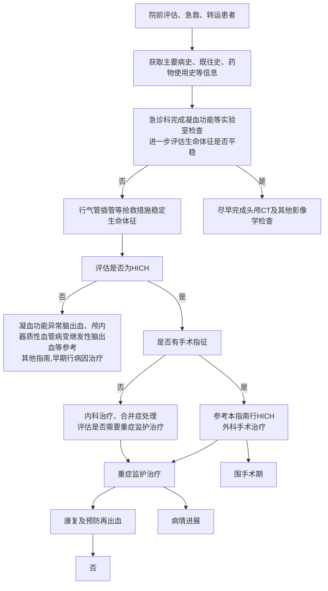

# 高血压性脑出血中国多学科诊治指南

中华医学会神经外科学分会 中国医师协会急诊医师分会 中华医学会神经病学分会 脑血管病学组 国家卫健委脑卒中筛查与防治工程委员会

通信作者: 游潮, 四川大学华西医院神经外科, 成都 610041, Email: Youchao@vip.

126.com;刘鸣,四川大学华西医院神经内科,成都 610041,Email:wyplmh@hotmail.com;

于学忠,中国医学科学院北京协和医院急诊科 100730,Email: xuezhongyu@gmail.com

DOI: 10.3760/cma.j.cn112050-20200510-00282

# 一、概述

高血压性脑出血（hypertensive intracerebral hemorrhage, HICH）指具有明确高血压病史的患者突然发生基底核区、丘脑、脑室、小脑及脑干等部位的脑实质出血，并排除外伤、血管结构异常性疾病、凝血功能障碍、血液性疾病、系统性疾病及肿瘤性疾病引起的继发性脑出血。HICH具有发病率、病死率、致残率及复发率均较高的特点。HICH的防治需要急诊科、影像科、神经内科、神经外科、重症医学科及康复科等多学科的合作。2015年，由中华医学会神经外科学分会、中国医师协会急诊医师分会、国家卫生和计划生育委员会脑卒中筛查与防治工程委员会组织国内多学科专家，共同制定了《自发性脑出血诊断治疗中国多学科专家共识》[1]，对指导和规范我国自发性脑出血（spontaneous intracerebral hemorrhage, SICH）的诊治起到了重要作用。近5年来，随着大量多学科的研究进展和新的循证医学证据的发表，依据我国基本国情，将共识升级为指南将有助于国内各级医疗单位在临床实践过程中更好地制定决策。本指南主要针对我国SICH中最常见、诊治争议较多的HICH进行介绍[2-3]，并参照2015年美国心脏协会/美国卒中协会（AHA/ASA）SICH指南的证据级别予以推荐。推荐级别：I级为应当实施，IIa级为实施是适当的，IIb级为可以考虑，III级为无益或有害；证据级别：A级为多中心或多项随机对照试验，B级为单中心单项随机对照试验或多项非随机对照试验，C级为专家意见，病例研究。

# 二. 急救处理和神经影像学检查

# (一)院前急救

HICH 早期进展迅速,容易出现神经功能恶化,规范的院前急救对预后至关重要 $^{[4]}$ 。院前处理的关键是迅速判断疑似 HICH 的患者,急救人员应首先获取患者的主要病史信息,包括症状发作的时间、既往病史、药物史及家庭成员联系方式等。若患者有突发头痛、呕吐、意识状态下降、肢体运动障碍、失语等表现,特别是伴有原发性高血压或糖尿病病史时,应高度怀疑卒中。应立即检查患者的生命体征、意识状况及瞳孔变化。若心跳、呼吸已停止,应立即行胸外心脏按摩和人工呼吸;若呼吸道不通畅,应立即清理气道分泌物;若呼吸频率异常、血氧饱和度下降,可现场行气管插管,球囊辅助呼吸;若循环系统不稳定,心跳、血压出现异常,可快速建立静脉通道进行补液和用药,纠正循环系统的异常。在因地制宜进行初步的诊断、心肺复苏、气道处理及循环系统支持后,需快速将患者转运至有条件的医院。急救人员应提前通知急诊科有疑似卒中患者即将到来,以便启动卒中绿色通道,并通知相关科室。这样可以在患者到达之前启动救治环节或路径 $^{[5]}$ 。急诊医疗服务体系能有效缩短从发病至到达医院及行 CT 扫描的时间 $^{[6]}$ 。最近有研究表明,有远程放射诊断支持的院前车载移动 CT 扫描对卒中具有较高的诊断价值 $^{[7-8]}$ 。

由于院前急救所面对的情况复杂,且条件有限,在没有影像学支持下,很难依靠临床表现准确鉴别出血性和缺血性卒中。尽管有研究认为,积极控制血压可能改善 HICH 患者的预后 $^{[9-10]}$ ,但尚不建议院前急救人员盲目行降血压治疗 $^{[11]}$ 。

推荐意见:对突然出现的疑似 HICH 患者,急救人员应迅速评估,并进行现场因地制宜的紧急处理,后尽快将患者转送至附近有救治条件的医院(Ⅰ级推荐,C级证据)。

# (二)急诊处理

各级医院的急诊科均应做好处理 HICH 患者的预案,若所在医院没有进一步处理 HICH 的条件,应迅速将患者转送至上一级医疗中心。到达急诊科后应采取措施进一步稳定患者的生命体征，对躁动者行必要的镇静、镇痛处理。在此基础上，行快速的影像学和必要的实验室检查，尽快明确诊断并迅速收入到相关专业科室救治，在急诊科滞留时间过长会影响患者的预后。急诊处理流程如下：（1）常规持续监测生命体征、心电图及血氧饱和度等；动态评估意识状况、瞳孔大小及肢体活动情况；清理呼吸道，防止舌根后坠，保持呼吸道通畅；若患者意识状态差（刺痛不能睁眼，不能遵嘱），或常规吸氧及无创辅助通气不能维持正常的血氧饱和度，则需进行气管插管保护气道、防止误吸，必要时行机械通气辅助呼吸[12]。建议采用格拉斯哥昏迷评分（GCS）、美国国立卫生研究院卒中量表（NIHSS）或脑出血评分量表评估病情的严重程度[13]。（2）迅速建立静脉通道，昏迷患者应留置导尿管。（3）快速行头颅CT或MRI检查，以明确诊断。（4）完善必要的急诊常规实验室检查，主要包括：①血常规、血糖、肝肾功能及电解质；②心电图和心肌缺血标志物；③凝血酶原时间、国际标准化比值及活化部分凝血活酶时间等。（5）若患者存在脑疝表现，濒临死亡，除进行心肺支持外，应迅速降低颅压，常用的降颅压药物有甘露醇、甘油果糖等；同时立即邀请相关学科会诊进行紧急处理。（6）在排除脑疝和颅内高压所导致的库欣反应后，可考虑在维持正常脑灌注的前提下，进行控制性降血压[9-10,14]。（7）有条件的医院尽早进行专科治疗，以预防血肿扩大（hematoma enlargement, HE）、控制脑水肿、防止并发症、降低颅内压及防止脑疝的形成等[15]。

推荐意见:急诊对疑似出血性卒中患者应快速地进行初诊和评估,稳定生命体征,行头颅 CT 等影像检查明确 HICH 诊断,完成急诊必要的实验室检查(Ⅰ级推荐,A 级证据)。

# (三)神经影像学检查

1. 影像学检查方法: HICH 一般均为急性起病, 及时而快捷的影像学检查对于明确诊断、确定出血部位及出血量至关重要[16]。头颅 CT 平扫对于急性颅内出血具有快捷、敏感、经济及高效的优势, 是急性颅内出血影像诊断中最重要、最基础的检查手段, 应作为首选检查方法。MRI 具有多参数、多序列成像的特点, 能敏感探测到出血后血红蛋白演变引起的信号改变, 可以对 CT 难以判断的等密度血肿进行准确诊断, 并有助于 HICH 和脑动脉淀粉样变性、海绵状血管畸形及动静脉血管畸形等病变所致出血的鉴别诊断 $^{[17]}$ 。但由于 MRI 检查费用较高、耗时较长，且对患者的状态和耐受性有更高要求，故对于重症 HICH 患者，不推荐作为首选检查方法。如果临床需要，在患者状况和医疗条件允许的情况下，进行必要的 MRI 检查可为临床提供更为丰富的信息。CT 血管成像（CTA）、MR 血管成像（MRA）及数字减影血管造影（DSA）能显示血管管腔及管壁的情况，可作为重要的补充检查手段。其中 CTA 由于操作简便迅速、无创分辨力高，对于排查脑血管病变有明显的时效优势。MR 静脉成像（MRV）能显示颅内静脉及静脉窦情况，早期发现颅内静脉血栓形成所引起的静脉性梗死或出血，在与 HICH 的鉴别中有重要价值。

2. HE 的预测:随着时间的推移,有近 1/3 的脑出血患者出现 HE。HE 的定义在不同的文献中有所不同,较为常用的判断标准为扫描时血肿体积与首次影像学检查体积相比,相对体积增加 >33% 或绝对体积增加 >12.5 ml $^{[18]}$ ,但也有大型临床研究将绝对体积增加定义为 >6 ml $^{[19]}$ 。近年来,有不少关于 CT 检查预测 HE 的报道。2007 年,Wada 等 $^{[20]}$ 首次报道“斑点征”与 HE 的关系,“斑点征”是 CTA 上血肿内 1\~2 mm 的增强信号影,其预测 HE 的灵敏度为 91%,特异度为 89% $^{[11]}$ ;斑点征的评分与患者的临床预后密切相关 $^{[14]}$ 。“渗漏征”是在首次 CTA 扫描 5 min 后行延迟二次扫描,计算病变兴趣区 CT-HU 值变化,若延迟扫描中 CT-HU 值较前 >10%,则为“渗漏征”阳性。一项前瞻性研究显示,“渗漏征”预测 HE 的灵敏度为 93.3%,特异度为 88.9%,且与不良预后显著相关 $^{[21]}$ 。

由于“斑点征”和“渗漏征”的检出需要行增强CT扫描，操作相对繁琐，故从平扫CT上的血肿征象预测HE的研究不断涌现，如“黑洞征”[22]、“混杂征”[23]及“岛征”[24]。“黑洞征”定义为在平扫CT上血肿内相对高密度区域完全包裹着相对低密度区域。“混杂征”定义为血肿内混杂着界限清楚的相邻的低密度和高密度区域，CT-HU值至少相差18HU，且相对低密度区域不能包裹在高密度区域内。“岛征”定义为存在与主要血肿分开的 $\geqslant 3$ 个散在的小血肿，或部分或全部与主血肿相连的小血肿 $\geqslant 4$ 个。但上述影像征象预测HE的灵敏度和特异度需要进一步行前瞻性研究加以证实。

Brouwers 等 $^{[19]}$ 通过前瞻性大样本队列研究设计了 9 分法用来预测 HE 的发生。该研究纳入了华法林药物服用史、发病至首次行头颅 CT 检查的时间、基线血肿体积、CTA“斑点征”等作为变量来评价HE发生的风险。结果表明，随着评分的增高，HE的发生率也随之增高。也有报道采用“BRAIN”24分评分系统预测HE。该研究纳入基线血肿体积、脑出血是否复发、服用华法林史、脑室出血及发病至首次行头颅CT检查时间5个指标。0分者HE的发生率为 $3.4\%$ ，24分者升至 $85.8\%^{[25]}$ 。

推荐意见:(1)接诊后尽早行头颅CT或MRI检查,明确HICH诊断(I级推荐,A级证据)。(2)CTA、MRI、MRA、MRV及DSA可用于诊断或排除颅内动脉瘤、动静脉畸形、肿瘤、烟雾病及颅内静脉血栓形成等引发的继发性脑出血(I级推荐,B级证据)。(3)有条件的单位应常规行CTA检查,在排除继发性脑出血的同时,其显示的“斑点征”可用以预测HE的风险(Ⅱa级推荐,A级证据)。(4)平扫CT上显示的“黑洞征”、“混杂征”及“岛征”可能有助于预测HE的风险(Ⅱb级推荐,B级证据)。(5)评估HE风险应综合考虑基线血肿体积、口服抗凝药物史、发病至首次头颅CT检查时间等因素(I级推荐,A级证据)。

# 三. HICH 的诊断和鉴别诊断

1. HICH 的诊断: 需要满足以下 2 条, (1) 有明确的高血压病史, 突发头痛、呕吐、肢体运动功能障碍、失语甚至昏迷等症状。(2) 影像学检查提示典型的出血部位, 如基底核区、丘脑、脑室、小脑、脑干等 $^{[26]}$ 。  
2. 鉴别诊断:需排除以下继发性出血的原因,(1)排除凝血功能障碍和血液系统相关疾病。(2)行相关影像学(1\~2种)检查,排除颅内动脉瘤、颅内动静脉畸形、烟雾病等脑血管病变。(3)超早期(72 h内)或晚期(血肿及含铁血黄素完全吸收后,一般需2\~3个月)行头颅增强MRI检查,排除颅内肿瘤。

推荐意见: HICH 诊断缺乏金标准, 主要依靠排除性诊断。确诊 HICH 需要行全面的相关检查, 排除其他各种继发性脑出血疾病 (I 级推荐, C 级证据)。

# 四. HICH 专科非手术治疗

# (一)颅内压(ICP)的监测和治疗

颅内高压是 HICH 重症监护和治疗的重点内容。2019 年的一项系统评价发现，HICH 后颅内高压的发生率高达 67%，与颅内高压相关的总体病死率为 50% $^{[27]}$ 。近来研究显示，颅内高压发生的频率与 HICH 后病死率及不良功能预后独立相关 $^{[28-29]}$ ，但 ICP 监测 $^{[30-31]}$ 及降颅压治疗 $^{[32]}$ 是否能改善患者的预后尚不明确。脑出血种族差异研究(ERICH)是一项关于HICH流行病学调查的多中心前瞻性病例对照研究。一项基于ERICH的回顾性研究发现，HICH后常规监测ICP并不能改善患者的预后[31]。相反，2020年国内的一项回顾性对照研究结果显示，在ICP监测下的治疗能够改善HICH患者短期和长期的神经功能缺损症状，并降低病死率，特别是对发病时GCS $9\sim 12$ 分的患者效果显著[30]。参考颅脑创伤ICP监测指南，结合多家医院对HICH的监测治疗经验，建议有条件时可对GCS $3\sim 8$ 分的重症HICH患者监测ICP，对GCS $9\sim$ 12分的患者应根据具体的临床表现、影像学资料及全面治疗的需求综合评估ICP监测的必要性。在不具备有创ICP监测的条件时，应结合临床表现（如头痛进行性加重，伴恶心、呕吐，意识下降等）和影像学情况（脑沟、脑池、脑室受压及中线偏移等）判断患者是否存在颅内高压的可能。

积极控制脑水肿、降低 ICP 是脑出血急性期治疗的重要环节。对 ICP 持续≥20 mmHg(1 mmHg = 0.133 kPa)或临床和影像学提示颅内高压的患者，应采取降颅压措施，除抬高头位、镇痛、镇静、保持气道通畅、避免膀胱过度充盈等措施外，使用甘露醇或高钠盐水行高渗脱水治疗是最常用的降颅压方法。甘露醇在降低 ICP 的治疗中应用最为广泛，根据病情可选择剂量为 0.25 \~ 1.5 g/kg, 1 次/4 \~ 6 h; 当血浆渗透压高于 320 mmol/L，甘露醇则失去渗透脱水的作用。肾功能不全的患者应禁用或慎用甘露醇，防止加重肾功能损害。可选用甘油果糖、人血白蛋白、利尿剂等其他降颅压药物。高渗性脱水在降低 HICH 后颅内高压方面疗效较确切 $^{[33]}$ ，但基于急性脑出血强化降血压研究(INTERACT)2 和 ERICH 的倾向性评分配对研究显示，甘露醇及其他高渗治疗并不能明显改善患者的预后 $^{[27,34]}$ 。

推荐意见:(1)对所有 HICH 患者都应进行 ICP 的评估和判断,及时对颅内高压进行处理,防止发生严重的高颅压甚至脑疝(Ⅰ级推荐,B 级证据)。(2)有条件时可以考虑对 GCS 3\~8 分的患者进行有创性 ICP 监测(Ⅱb 级推荐,C 级证据)。(3)甘露醇和高渗盐水等药物可减轻脑水肿、降低 ICP、减少脑疝发生风险;可根据具体情况选择药物的种类、剂量及给药次数(Ⅰ级推荐,C 级证据)。

# (二)镇静、镇痛治疗

镇静、镇痛是重症 HICH（GCS < 8 分）患者治疗的重要组成部分。其可以减轻应激反应，在辅助降血压防止 HE 的同时,也有利于控制颅内高压。常用的镇静模式有程序化镇静、每日中断镇静及早期目标导向性镇静,需要根据患者的病情个体化制定镇痛、镇静策略。常用的镇静、镇痛药物包括丙泊酚、咪达唑仑、芬太尼及吗啡等。当预计需要在短时间内进行意识评估时,可以选择低剂量丙泊酚持续静脉泵入;近期无需行意识评估时,可以选择咪达唑仑。

推荐意见:建议对重症 HICH 患者,特别是伴躁动者,行镇静、镇痛治疗(I级推荐,C级证据)。

# (三)HICH 后的血压管理

HICH 后急性期常合并高血压。有证据显示，高血压特别是收缩压升高与 HICH 后 HE、脑水肿加重、死亡及不良预后密切相关。但降低血压可能导致脑和其他器官的缺血性损伤。因此，HICH 急性期血压管理至关重要 $^{[35-36]}$ 。

1. 降压治疗的安全性和有效性: 近来发表的 INTERACT、INTERACT 2、急性脑出血降血压治疗临床试验 (ATACH)、ATACH-Ⅱ、脑出血急性降动脉压研究 (ADAPT) 等多项临床试验研究均针对早期降压或早期强化降压 (在发病后 6 h 内将收缩压降至 140 mmHg 以下并维持至少 24 h) 问题进行了广泛深入的探讨 $^{[36-40]}$ 。

2013 年发表的 ADAPT 研究结果显示,强化降压不影响血肿周围的相对脑血流量 $^{[37]}$ 。同年发表的 INTERACT 2 研究不仅证实了早期强化降压的安全性,还提示早期强化降压改善预后的作用优于既往将血压将至 180 mmHg 以下的疗效 $^{[39]}$ 。2016 年发表的 ATACH-Ⅱ 研究对比了“超早期”(发病 4.5 h 内)“快速强化”(将收缩压降至 140 mmHg 以下并维持 24 h)降压治疗与标准降压(收缩压 140 \~ 180 mmHg)治疗的差异。结果显示,积极的降压治疗并未改善患者的神经功能缺损预后;相反,由于过度的降压治疗导致肾功能异常不良事件增加 $^{[40]}$ 。与 INTERACT 2 研究对比,ATACH-Ⅱ 研究结果可能与过快强化降压且降压幅度较大有关。INTERACT 2 的亚组分析显示,控制收缩压 $\leqslant$ 130 mmHg与预后不良及颅外缺血性并发症相关 $^{[41]}$ ,而 ATACH-Ⅱ 首个 24 h 内将收缩压平均降至 120 \~ 130 mmHg,停止降压的下限值为 110 mmHg。

对严重颅内高压伴发库欣反应或脑疝的患者，血压升高是机体为维持脑灌注压产生的代偿性反应。对于此类患者，建议首先降颅压，不能直接降血压。

2. 降压治疗的收缩压幅度: Wang 等 $^{[42]}$ 基于 INTERACT 2 研究数据探讨 HICH 后不同时段 (15 \~ 60 min、>1 \~ 24 h、>24 h 至第 7 天) 降压幅度与临床预后间的关系, 发现在上述不同时间段, 降压幅度越高不良结局的发生率越低, 提示在接诊后第 1 小时内将收缩压降低至目标值 (140 mmHg), 并维持 7 d, 脑出血患者的预后最佳。HICH 急性期予以静脉给药可以实现快速平稳降压的目标。常见的静脉降压药包括乌拉地尔、拉贝洛尔、盐酸艾司洛尔、依拉普利及尼卡地平等。以乌拉地尔为例, 在 HICH 急性期, 推荐先静脉注射负荷量, 建议剂量为 12.5 \~ 25.0 mg, 并连续监测血压。若血压无变化, 每 2 分钟可重复注射, 总量可达 100 mg。达到目标血压后持续静脉输注, 并维持给药平稳控制血压。

3. HICH 围手术期血压的控制: 在中国, HICH 的手术治疗较欧美国家开展更多, 但 HICH 围手术期的血压管理目标仍然不清楚。有单中心随机对照试验 (PATICH) 评估围手术期强化降压的作用。该研究纳入 201 例 HICH 患者, 围手术期强化组血压控制在 120 \~ 140 mmHg, 对照组在 140 \~ 180 mmHg。结果显示, 围手术期强化降压是安全的, 但不能降低术后再出血、死亡及其他严重不良事件的发生率 $^{[43]}$ 。

推荐意见:(1)收缩压在 150 \~ 220 mmHg,且无急性降压治疗禁忌证的 HICH 患者,急性期将收缩压降至 140 mmHg 是安全的(Ⅰ级推荐,A 级证据),降至 130 mmHg 以下会增加颅外缺血风险(Ⅲ级推荐,A 级证据)。(2)收缩压 > 220 mmHg 的脑出血患者,连续静脉用药强化降低血压和持续血压监测是合理的,但在临床实践中应根据患者的高血压病史长短、基础血压值、ICP 情况及入院时的血压情况个体化决定降压目标(Ⅱa 级推荐,C 级证据)。(3)收缩压在 150 \~ 220 mmHg,且无急性降压治疗禁忌证的患者,围手术期收缩压降至 120 \~ 140 mmHg 可能是安全的(Ⅱb 级推荐,B 级证据)。

# (四)防治 HE 的药物

HE 是早期神经功能恶化和长期临床结局不良的重要危险因素 $^{[44]}$ 。预防 HE 的措施主要包括血压管理和止血药的使用。

1. 降血压治疗: 出血后血压升高与 HE 相关的结论已在前文叙述。有相关研究对降压治疗是否可以降低 HE 发生进行了研究, INTERACT 2 研究 HE 的亚组分析显示, 强化降压有明显降低 HE 的趋势 (OR = 0.78, 95% CI: 0.58 \~ 1.03, P = 0.08), 但差

异无统计学意义 $^{[40]}$ 。

2. 止血药使用: 因止血药被认为可以限制 HE 而用于治疗 HICH。重组 VIIa 因子 (rF VIIa) 作为一种促凝剂最早尝试用来治疗 HICH。研究证实, rF VIIa 可以降低再出血率, 但不能改善患者的预后和生存率。氨甲环酸通过抗纤溶来稳定脑血肿, 防止 HE 发生。TICH-2 是国际上第一个大型多中心随机对照试验 (RCT), 纳入 2325 例 HICH 患者, 比较氨甲环酸与安慰剂在 HICH 中的作用 $^{[45]}$ 。该三期临床试验结果显示, 出血 8 h 内给予氨甲环酸能够明显降低 HE 的发生率及 7 d 内的病死率, 但不能改善 90 d 的神经功能预后。

目前,已有研究结合影像学指标筛选出 HE 风险高的 HICH 患者,探讨此类患者接受氨甲环酸的疗效。TICH-2 试验中探讨了 CT 平扫血肿征象(如“岛征”“混合征”等)与氨甲环酸治疗反应性的关系,并未发现任何阳性征象与氨甲环酸疗效存在明显的相关性 $^{[46]}$ 。“斑点征”联合氨甲环酸防止脑出血扩大的澳大利亚临床试验(STOP-AUST) $^{[47]}$ 和斑点征预测氨甲环酸防止急性脑出血后血肿扩大疗效研究(TRAIGE) $^{[48]}$ 均为前瞻性多中心 RCT 研究,拟观察氨甲环酸在“斑点征”阳性患者中的疗效,目前2个试验均在进行中。值得注意的是,过度或较长时间应用止血药有诱发脑缺血性疾病的风险。

推荐意见: (1) HICH 后血压升高 (>160 mmHg) 有促进 HE 的风险 (Ⅱa 级推荐, B 级证据); 强化降压 (<140 mmHg) 有可能降低 HE 的发生率 (Ⅱb 级推荐, A 级证据)。(2) 氨甲环酸可以降低 HE 的发生率 (Ⅱa 级推荐, A 级证据), 但不能改善生存率及神经功能预后 (Ⅲ级推荐, A 级证据)。(3) CT 平扫显示血肿 “岛征” “混合征” 等阳性征象的患者中, 氨甲环酸抗纤溶治疗不能改善预后 (Ⅲ级推荐, B 级证据)。

# (五)其他

其他非手术治疗包括在神经重症监护病房(NCIU)或者卒中单元(stroke unite)对HICH患者进行生命体征、内环境及并发症等多方位监护和处理。

1. 血糖：对于 HICH 患者，高血糖可使患者的不良预后和病死率增加 $^{[49]}$ ，而低血糖则可导致脑缺血损伤及脑水肿。因此，需监测血糖并将其控制在正常范围(7.8\~10.0 mmol/L)。

2. 体温: HICH 后发热, 尤其是脑室出血的患者发生率很高, 而治疗性降温可以减轻血肿周围水肿 $^{[50]}$ 。

因此,有必要定时监控体温( $\leqslant$ 38.5℃为宜)。

3. 癫痫: HICH 后癫痫发作, 尤其是癫痫持续状态会增加 ICP、加重脑缺血, 威胁患者的生命, 应积极选用药物控制癫痫发作。一项大样本回顾性研究推荐对于皮质受累的脑叶血肿、血肿量 > 10 ml、患者年龄 < 65 岁及 HICH 发病 7 d 内有癫痫发作的高风险患者, 可以行预防性抗癫痫治疗 $^{[51]}$ 。

4. 感染: 有研究显示, 感染相关并发症是导致 HICH 患者 30 d 内再入院的主要原因, 包括肺部感染、败血症、尿路感染、颅内感染及胃肠道感染等, 其中肺炎的发生率最高 $^{[52]}$ 。因此, 除了积极抗感染治疗外, 还应加强气道保护, 避免吞咽困难和误吸, 降低 HICH 患者发生肺炎的风险 $^{[53]}$ 。

5. 血栓形成: HICH 患者发生血栓性疾病的风险高, 入院后尽早使用间歇性空气压缩装置可有效预防下肢深静脉血栓形成 $^{[54]}$ 。HICH 患者若发生下肢深静脉血栓形成或肺栓塞, 可考虑行全身抗凝或安置下腔静脉过滤器 $^{[55]}$ 。

6. 其他系统并发症: HICH 患者可能发生急性心肌梗死、心力衰竭、室性心律不齐、心脏骤停、急性肾功能衰竭、低钠血症、胃肠道出血及卒中后抑郁等其他各种并发症。应积极对每种并发症进行全面筛查、评估及监测，力求早预防、早发现、早治疗。

推荐意见:(1)HICH 患者应该在配备有专业医护人员的 NICU 或者卒中单元进行监测和治疗(Ⅰ级推荐,B 级证据)。(2)无论既往是否有糖尿病,均应监测血糖,并将血糖控制在正常范围,避免过高或过低(Ⅰ级推荐,C 级证据)。(3)应控制 HICH 患者发热,防止体温过高(>38.5 ℃)(Ⅱb 级推荐,C 级证据)。(4)对于癫痫发作,应使用抗癫痫药物进行治疗(Ⅰ级推荐,B 级证据)。(5)对于血肿累及皮质区的患者,可以预防性使用抗癫痫药物(Ⅱa 级推荐,C 级证据)。(6)在患者开始进食前,应进行吞咽功能评估,降低发生吸入性肺炎的风险(Ⅰ级推荐,B 级证据)。(7)HICH 患者入院后尽早使用间歇性空气压缩装置,预防静脉血栓形成(Ⅰ级推荐,B 级证据)。

# 五. HICH 的外科治疗

血肿体积是决定 HICH 预后的最重要因素。血肿越大, 占位效应越明显, 血肿内神经毒素含量越高, 造成的继发性脑损伤越严重。临床研究表明, 血肿大小与 NIHSS 评分呈正相关, 是脑出血后病情严重程度的重要预测指标, 其不仅与短期死亡和神经功能预后相关, 也与长期预后相关。因此, 血肿清除成为治疗 HICH 的重要手段,其目的在于尽快解除血肿对脑组织的压迫、缓解严重颅内高压及脑疝、挽救生命,并尽可能降低由血肿压迫导致的继发性脑损伤,提高患者术后的生命质量。目前,国内外已开展多项外科手术治疗脑出血的 RCT 研究,但在手术治疗的价值、术式、手术时机及疗效等方面仍有较大的争议。

# (一)小脑幕上出血的外科治疗

我国 HICH 发病率明显高于西方国家,在诊治方面积累了较丰富的经验,对以基底核区为代表的深部颅内血肿伴严重颅内高压甚至脑疝的患者进行手术已经成为常规。虽然目前尚缺乏高级别的循证医学证据,但手术治疗在拯救患者生命方面的作用是肯定的。

1. 小脑幕上血肿的手术指征 $^{[56]}$ : (1) 颞叶钩回疝。(2) CT、MRI 等影像学检查有明显 ICP 升高的表现(中线结构移位超过 5 mm; 同侧侧脑室受压闭塞超过 1/2; 同侧脑池、脑沟模糊或消失)。(3) ICP > 25 mmHg。符合上述中任何一项即可尽快或紧急手术, 目标是迅速缓解颅内高压或脑疝, 挽救患者的生命。常见术式有骨瓣开颅、骨窗开颅、神经内镜手术及基于立定定向原理引导下的血肿穿刺清除血肿等。每种术式各有特点, 术者可根据个体化设计原则, 选择更符合病情且自己更擅长的术式。需要强调的是, 微创是一种理念, 而非一种术式和技术。依靠现有的设施条件和技术, 最大限度地去除病变并保护神经、血管及组织, 即为微创。任何手术和术式都应在微创理念指导下进行设计和操作。

对于小脑幕上血肿量<20 ml、无明显颅内高压临床症状和影像学表现的患者，一般应该选择内科治疗。对于有一定颅内压增高，但并无脑疝风险，血肿量为20\~40 ml的病情中等严重程度的HICH患者，手术清除血肿是否能够改善神经功能障碍、加速康复等，目前尚无明确结论，有待进一步深入研究。

2. 开放手术清除血肿:开放手术包括常规骨瓣开颅术和小骨窗开颅术。与小骨窗开颅术相比,骨瓣开颅术对头皮和颅骨的损伤较大,但可在直视下彻底清除血肿,止血可靠,减压迅速,必要时还可行去骨瓣减压,是 HICH 最为常用和经典的开颅手术入路。小骨窗开颅术对头皮颅骨的损伤小,操作相对简单,可迅速清除血肿,直视下止血也较满意。无论采用常规骨瓣开颅术还是小骨窗开颅术,颅内操作流程基本相同[1]。如果术中脑组织肿胀明显,颅内压下降不满意,对骨瓣开颅者还可行去骨瓣减压术。

英国学者 Mendelow 领导的手术治疗脑出血研究(STICH)是第一个评估开颅血肿清除术治疗小脑幕上出血疗效的大型前瞻性多中心 RCT 研究 $^{[57]}$ 。此研究历时 8 年，纳入 83 家医疗中心、1033 例发病 $\leqslant$ 72 h 的患者，平均血肿体积为 40 ml。研究结果显示，接受手术者预后良好的比率为 26%，而内科治疗者为 24%，差异无统计学意义，手术并未改善患者的预后。但亚组分析提示，浅表血肿（距皮质 $\leqslant$ 1 cm）清除后患者的预后有改善的趋势。基于此，同一团队又开展了 STICH II 期临床试验 $^{[58]}$ ，纳入发病 $\leqslant$ 48 h 的小脑幕上浅表血肿患者，血肿量为 10～100 ml。结果显示，开颅手术依然不能改善此类患者的预后。这 2 项研究是目前最大样本量的开颅手术治疗脑出血的临床试验，奠定了脑出血外科治疗研究的基石。STICH 的研究结果为中性结论，既没有证明开颅手术有益，也没有证明有害。但不可否认，STICH 系列研究存在一些不足，如 STICH II 研究纳入患者的血肿量差异较大、未明确外科手术治疗指征、手术质量难以统一等 $^{[56]}$ 。

我国早在2001年就开展了比较内、外科治疗HICH疗效的多中心、前瞻性RCT研究[59]。结果发现，外科组近期病死率（ $9.8\%$ ）和远期病死率（ $11.8\%$ ）均低于内科组（分别为 $14.5\%$ 和 $18.7\%$ ）；外科组远期神经功能优良率（ $67.3\%$ ）优于内科组（ $57.8\%$ ），上述结果差异均有统计学意义。该研究排除了其他类型的自发性脑出血，病例来源既纳入了基层二级医院者，也包括了大型三甲医院者，结果具有很强的可推广性。一项关于内、外科治疗脑出血的荟萃分析纳入了包括上述研究在内的13个RCT研究，分析结果显示，外科组术后 $3\sim 12$ 个月病死率明显降低，术后 $6\sim 12$ 个月生活能力明显优于内科组[60]。

3. 基于立体定向技术的血肿清除术: 立体定向技术包括有框架定位技术、无框架脑立体定向技术、方体定向技术及神经导航技术等。有分析认为, 开放手术造成的损伤(皮质切开, 脑组织牵拉及电凝操作)可能不同程度抵消了血肿清除的疗效, 而基于立体定向技术血肿清除术可能更有助于改善预后。2019年, 全球多中心RCT微侵袭手术联合重组组织型纤溶酶原激活剂(rt-PA)清除脑出血研究(MISTIE)Ⅲ试验结果发表于Lancet杂志 $^{[61]}$ 。该三期临床试验共纳入全球78家医院506例以HICH为主的小脑幕上出血(血肿量均>30ml)患者, 探讨立体定向下穿刺血肿置管联合rt-PA(阿替普酶)的疗效。结果显示,45%的手术患者获得良好预后,与内科治疗组的41%相比,差异并无统计学意义。但亚组分析发现,将血肿残留体积控制在15 ml以下后,术后1年神经功能预后更好,这一发现为以后临床试验终点指标的制定提供了方向。

我国在应用基于立体定向原理进行血肿清除术治疗 HICH 方面积累了较丰富的经验。一项纳入 116 例 HICH 患者的单中心 RCT 研究将患者随机分为立体定向血肿清除组和内科治疗组，血肿体积均 >30 ml，显示手术患者的病死率和重度残疾率均明显下降 $^{[62]}$ 。另一项 RCT 结果显示，与内科常规治疗相比，基于立体定向手术治疗 HICH 能减轻对血脑屏障的破坏，神经功能缺损症状明显减轻 $^{[63]}$ 。一项 RCT 研究进一步探讨了采用立体定向血肿穿刺置管清除术治疗中小型出血量 HICH 的疗效。该研究将 68 例出血量约为 30 ml 的 HICH 患者随机分为立体定向清除血肿组和内科治疗组。结果显示，手术的患者平均住院时间缩短，术后 6 周的神经功能改善优于内科治疗组 $^{[64]}$ 。另一项 RCT 研究亦得出类似的结论 $^{[65]}$ 。但以上研究均不同程度地存在样本量偏小、设计及质量控制不够严谨等不足，特别是对中小量血肿的手术目标和疗效，尚有待进一步深入研究。

4. 神经内镜清除血肿术: 采用神经内镜治疗HICH 可以在短时间内清除大量血肿, 同时可以在直视下止血; 但也存在创道较大, 可能伤及重要白质纤维束等潜在的缺点。术中机械操作特别是在靠近血肿床时易损伤周围脑组织。早在 1989 年, 一项单中心 RCT 研究对比神经内镜与内科治疗小脑幕上自发性脑出血的疗效, 每组各 50 例患者[66]。结果显示, 神经内镜治疗能降低皮质下血肿患者的病死率, 提高神经功能良好预后的比率; 对于基底核或丘脑等深部出血者, 神经内镜手术有获益的趋势, 但差异无统计学意义。该研究由于纳入的病例数有限, 很难得出差异有统计学意义的结果。术中 CT 立体定向引导内镜手术治疗脑出血研究 (ICES) 临床试验是评估基于术中 CT 影像定位的神经内镜清除脑血肿的多中心 RCT 研究[67], 但目前只有临床安全性评估结果。该试验纳入的患者均为发病 48 h 内、血肿量 >20 ml; 其中手术组 14 例, 内科治疗组 6 例。结果显示, 神经内镜治疗可以在出血后 29 h 内立刻减少 68% 的血肿体积, 长期预后良好患者的比率较内科治疗组高 19.2%。但由于样本量太小无法得出令学术界信服的结论。

国内的一项回顾性研究纳入 128 例发病 24 h 内、血肿量≥30 ml 的小脑幕上 HICH 患者，比较神经内镜与开颅手术的疗效 $^{[68]}$ 。结果显示，术后 1 周和 6 个月，两组的病死率差异均无统计学意义；而神经内镜组的神经功能预后优于开颅手术组。另一项前瞻性研究纳入 104 例小脑幕上 HICH 患者，血肿量为 30～60 ml。结果显示，与传统开颅组比较，神经内镜组术后脑水肿显著减轻、血肿清除率显著提高、术后 7 d 的 ICP 显著降低、并发症发生率显著降低、术后 6 个月的预后良好率显著提高 $^{[69]}$ 。总体，采用神经内镜技术治疗 HICH 问世时间较短，尽管目前在临床方面已经显现出了诸多优势，但其确切的疗效和价值仍需要进一步大样本 RCT 研究结果来证实。

5. 去骨瓣减压术治疗 HICH: 去骨瓣减压术治疗小脑幕上 HICH 疗效仍不肯定。2017 年和 2019 年发表的 2 篇回顾性研究均显示,与内科治疗相比,去骨瓣减压术均能显著降低 HICH 患者的病死率,是否改善神经功能预后结果不一[70-71]。是否在血肿清除的基础上行去骨瓣减压术仍存在争议[72-73]。2016 年发表的一项小样本 RCT 研究比较去骨瓣减压联合血肿清除术与单纯血肿清除术治疗 HICH 的预后,每组各纳入 20 例患者。患者血肿量均 >60 ml;术前 GCS <8 分,或 GCS >8 分但内科治疗无效或发生神经功能恶化需要手术治疗者。结果发现,两组的病死率差异无统计学意义,但去骨瓣减压联合血肿清除术组术后 6 个月神经功能改善情况明显优于单纯血肿清除术组[74]。2018 年,一项关于采用去骨瓣减压术治疗 HICH 的系统回顾性研究纳入 8 篇文献进行分析。结果显示,去骨瓣减压术可显著降低不良预后率[75]。HICH 去骨瓣减压术的适应证目前仍不清楚,以下 3 条可供参考:(1)晚期脑疝患者。(2)术中清除血肿后,脑组织塌陷不明显,甚至高出骨窗者。(3)清除血肿后脑组织搏动不明显或搏动完全消失者。出现其中任何一条可考虑行去大骨瓣减压术。

# (二)脑室出血的外科治疗

脑室出血后血凝块溶解促进血肿吸收(CLEAR)研究是探讨纤溶治疗脑室出血的国际多中心RCT研究。一期研究显示了脑室内纤溶治疗的安全性，三期试验将样本量扩展到500例[76]。纳入标准包括血肿量 $< 30\mathrm{ml}$ 、脑室出血阻塞第三脑室或者第四脑室。试验组每8小时经脑室外引流管注射 $1\mathrm{mg}$ 阿替普酶，最多注射12次；对照组注射等量的生理盐水。结果显示,尽管两组的神经功能预后良好率相似,但进一步分析显示,选择合适的患者进行纤溶治疗可能是有效的,如对脑室出血>20 ml者,应更早、更快地清除血肿及将清除80%以上的血肿作为治疗目标等。

参考国内研究及治疗经验 $^{[77-78]}$ ，依据不同的血肿量进行相应治疗是合理的：（1）少量至中等量出血、患者意识清楚、GCS＞8分及无梗阻性脑积水，可采用内科治疗或行腰池持续外引流。（2）出血量较大，超过侧脑室50%；GCS＜8分，合并梗阻性脑积水者，可行脑室钻孔外引流术。（3）出血量大，超过脑室容积75%，甚至全部脑室血肿铸型；GCS＜8分，明显颅内高压者，可考虑行开颅手术直接清除脑室内血肿。

# (三)小脑幕下脑出血的外科治疗

1. 小脑出血的手术治疗:2015年,AHA/ASA协会根据一些回顾性研究结果,推荐对于小脑出血患者,如果有神经功能恶化或合并脑积水及脑干压迫的情况,应该尽快手术。术式包括开颅或立体定向钻颅置管血肿清除术,而不是仅行脑室钻孔引流术。为了进一步明确手术治疗小脑出血的预后,Kuramatsu等[79]纳入4项大型回顾性队列研究行荟萃分析。结果显示,手术治疗不能提高术后3个月神经功能良好患者的比率,但可显著提高短、长期的生存率。进一步分析发现,手术治疗的血肿量临界点为 $12 \sim 15 \mathrm{ml}$ ; $< 12 \mathrm{ml}$ ,术后神经功能良好预后者比率明显下降; $>15 \mathrm{ml}$ ,术后患者的生存率更高。值得注意的是,该研究纳入较多口服抗凝药的患者,结果不能推广到所有小脑出血的患者。

近来有回顾性研究报道各种术式治疗小脑出血的效果。Kellner等[80]采用小骨瓣开颅术清除小脑血肿，认为手术安全、有效。一项比较神经内镜与常规开颅手术清除血肿疗效的回顾性研究结果显示，神经内镜手术可以缩短手术时间、减少术中出血，但预后无明显差异[81]。

依据国内手术治疗高血压性小脑出血的经验，对于小脑出血伴有神经功能恶化或合并脑积水及脑干压迫的患者，应该尽快手术清除血肿，具体手术指征如下：(1) 血肿直径 >3 cm 或血肿量 >10 ml，第四脑室受压或完全闭塞，有明显的占位效应和颅内高压。(2) 脑疝（枕骨大孔疝为主）。(3) 合并明显梗阻性脑积水。术中要尽可能多地清除血肿，打通脑脊液循环通路。对于脑疝患者，可以进一步咬除寰椎后弓，开放枕骨大孔，彻底减压。

2. 脑干出血的手术治疗: 高血压性脑干出血的手术治疗价值尚不明确。一项回顾性病例对照研究显示, 手术治疗可以降低术后 30 d 的病死率, 但不能增加术后 90 d 神经功能良好者的比率 $^{[82]}$ 。国内采用手术治疗高血压性脑干出血的病例数远较国外多, 积累了一定的治疗经验 $^{[83-86]}$ 。游潮领导的研究提出具体的手术指征如下: (1) 血肿量 >5 ml, 血肿相对集中。(2) GCS < 8 分, 伴神经功能进行性恶化。(3) 生命体征不平稳, 特别是出血早期出现中枢性血压、体温、呼吸等明显异常。(4) 家属有强烈的手术意愿 $^{[8]}$ 。同时提出显微镜直视下“脑干无牵拉、血肿轻吸引及责任血管弱电凝”的操作要点 $^{[85]}$ 。2019 年, 该中心的一项回顾性病例对照研究显示, 46 例手术治疗组与 240 例内科治疗组比较, 显微血肿清除术能明显降低术后 6 个月的病死率, 尤以发病后 8 h 内超早期手术者的疗效最为显著 $^{[86]}$ 。同年, 一项对比评估立体定向血肿穿刺清除血肿手术与常规内科治疗重型脑干出血疗效的回顾性研究结果显示手术治疗疗效更优 $^{[87]}$ 。总体, 高血压性脑干出血的手术治疗仍在探索之中, 需要进一步展开规范化的大样本临床研究。

# (四)HICH 的手术时机

HICH 的手术时机仍存在争议。血肿清除术的理论基础是通过减轻占位效应或血液产物的细胞毒性来预防脑疝形成、减少血肿对周围组织的毒性作用。因此，理论上手术时机应越早越好。STICH II 的亚组分析表明，发病至手术时间 <21 h 的患者预后较好 $^{[88]}$ 。一项纳入 8 项 1989—2009 年采用手术清除血肿的 RCT 研究的系统评价结果显示，出血后 8 h 内进行手术有利于改善患者的预后 $^{[89]}$ 。2020 年纳入 21 项研究共 4 145 例的系统评价结果提示，HICH 后较早进行手术干预可能有益 $^{[90]}$ 。相反，早期的一项单中心前瞻性研究结果提示，发病后 4 h 内进行超早期开颅手术与再出血的风险增加有关，从而增加患者的病死率 $^{[91]}$ 。但因该研究仅纳入 11 例患者，难以得出可靠的结论。目前公认的观点是，对严重颅内高压甚至已经发生脑疝的患者，必须尽早手术，越早越好。

# (五)HICH 的手术操作要点及术后处理

无论何种类型的 HICH、采用何种入路和术式，均要避免或尽量减少手术对脑组织造成新的损伤，应遵循以下注意事项 $^{[56]}$ ：(1) 尽量在显微镜下精细操作。(2) 要特别注意保护侧裂静脉、大脑中动脉及其分支以及未出血的豆纹动脉。(3) 无牵拉或轻牵拉。(4) 轻吸引、弱电凝,保持在血肿腔内操作,尽量避免损伤脑组织。如果术中脑组织水肿明显,清除血肿后颅压下降不满意,可适当扩大骨窗范围并行去骨瓣减压术。

术后处理:依据 ICP 监护情况在必要时予以降低颅内压、血压管理、镇静、镇痛、预防和治疗颅内及肺部等感染、保持内环境稳定、营养支持、防止癫痫等。术后 24 h 内常规复查头颅 CT,以了解手术情况并排除术后再出血。

推荐意见:(1)对于小脑幕上 HICH 患者,若出现严重的颅内高压甚至脑疝,应紧急手术清除血肿;血肿清除在一定程度可以降低病死率并改善神经功能预后(Ⅰ级推荐,A 级证据)。(2)利用立体定向血肿穿刺联合纤溶药物治疗大型小脑幕上血肿(>30 ml)是安全的,血肿残存量<15 ml可能会改善患者的预后(Ⅱa 级推荐,A 级证据)。(3)神经内镜与传统开颅血肿清除术相比,可能对小脑幕上 HICH 患者预后的改善更好(Ⅱa 级推荐,B 级证据)。(4)对于伴严重颅内高压的小脑幕上 HICH,去骨瓣减压术联合或不联合血肿清除术均可以降低患者的病死率(Ⅱ a 级推荐,B 级证据)。(5)脑室外引流术可以降低大多数脑室出血患者的病死率(Ⅱ a 级推荐;B 级证据);利用立体定向血肿穿刺术联合纤溶药物不能改善脑室出血患者神经功能预后(Ⅱ b 级推荐,A 级证据)。(6)对出血量>10 ml 的小脑出血并合脑干受压或梗阻性脑积水患者,开颅手术可以挽救生命,但是否能改善神经功能尚无定论(Ⅱa 级推荐,B 级证据)。(7)对于重型脑干出血(血肿量>5 ml,GCS≤8 分),手术治疗可以降低病死率(Ⅰ级推荐,B 级证据)。(8)早期手术(发病 6\~24 h 内)可以改善预后(Ⅰ级推荐,B 级证据)。

# 六. HICH 的康复治疗

早期康复治疗对于 HICH 患者的功能恢复具有重要意义。2014 年我国的一项随机对照研究结果显示,与非早期康复者比较,在 HICH 后 48 h 至 1 周内开始早期康复的患者,平均住院时间明显缩短,患者的独立活动能力更强 $^{[92]}$ 。2019 年,来自中国台湾的一项 RCT 研究发现,对于轻、中度病情的 HICH 患者(NIHSS < 20 分)在发病后 24 \~ 72 h 内进行早期离开床位的康复活动(根据病情不同采取坐、站、走等活动)较常规卧床早期康复治疗更有利于患者的神经功能改善 $^{[93]}$ 。一般来说,患者生命体征平稳后即可开始康复治疗,发病后 3 个月内是“黄金”康复期,4\~6个月是“有效”康复期。

有充分证据表明,高度组织化的多学科院内治疗(卒中单元)均有助于提高存活率、改善神经功能及患者回归家庭。国内一项 RCT 研究纳入了364 例 HICH 患者,比较不同阶段在卒中单元内康复治疗与在标准病房和内科病房一般治疗患者的预后。随访6个月发现康复组的预后更好,尤以发病后第1个月最为显著 $^{[94]}$ 。

推荐意见:(1)所有 HICH 患者均应接受康复治疗(Ⅰ级推荐,B 级证据)。(2)应尽早开始康复治疗,并尽可能开展离开床位的康复训练(Ⅱa 级推荐,B 级证据)。

# 七. HICH 的复发和预防

HICH 具有高复发风险。高龄、高血压以及深部出血被认为是 HICH 复发的重要危险因素 $^{[95]}$ 。其中高血压可增加脑叶和深部出血的复发风险 $^{[96]}$ 。大量研究提示，既往有 HICH 病史、携带载脂蛋白 Eε2 或 ε4 等位基因以及 MRI 磁敏感加权成像序列显示大量微出血的患者具有较高 HICH 复发风险。不同人种 HICH 复发的部位也有差异，亚洲人多见于深部半球，其中基底核区最多。

对于 HICH 复发的预防,重点在于控制血压。此外,也应尽量避免其他危险因素的暴露,包括阻塞性睡眠呼吸暂停 $^{[97]}$ 、肥胖及不良生活方式等 $^{[98]}$ 。抗栓药物的使用有导致 HICH 复发的风险,由于抗栓治疗能够降低血栓事件的风险,故应谨慎评估 HICH 复发与血栓的风险获益比后,再行必要的抗栓治疗。

关于他汀类药物在 HICH 患者中的使用存在争议。一项纳入 31 项 RCT 研究的荟萃分析结果显示，他汀类药物治疗与 HICH 无显著相关性，但能显著降低所有卒中和全因病死率 $^{[99]}$ 。但也有研究提示，他汀类药物可能增高 HICH 的风险，应避免使用 $^{[100]}$ 。

推荐意见:(1)HICH 复发的风险因素包括初发出血部位、高龄、微出血、正在接受抗凝治疗及携带载脂蛋白 Eε2 或 ε4 等位基因,需要对这些因素进行分层评估(Ⅱa级推荐,B级证据)。(2)为了预防 HICH 复发,所有 HICH 患者均应控制高血压(I级推荐,A级证据)。(3)HICH 患者应谨慎使用他汀类药物(Ⅱb级推荐,C级证据)。HICH 诊治涉及多学科,具体流程见图1。

共识专家组成员（按姓氏汉语拼音排序）巢葆华（国家卫健委脑卒中防治工程委员会）、崔建忠（河北省唐山市工人医院神经外科）、程永忠（四川大学华西医院神经外科）、陈隆益（四川省人民医院神经外科）、陈谦学（武汉大学人民医院神经外科）、曹钰（四川大学华西医院急诊科）、陈瑶（四川大学华西医院急诊科）、程远（重庆医科大学第二附属医院神经外科）、查正江（安徽医科大学附属安庆医院神经外科）、曹志恺（广州市第一人民医院神经外科）、程祖钰（南昌大学第二附属医院神经外科）、董薇（四川大学华西医院重症医学科）、杜怡峰（山东省立医院神经内科）、冯华（陆军军医大学西南医院神经外科）、高国一（上海交通大学医学院附属仁济医院神经外科）、高亮（上海第十人民医院神经外科）、高宇飞（吉林大学中日联谊医院神经外科）、胡波（华中科技大学同济医学院附属协和医院神经内科）、杭春华（南京大学医学院附属鼓楼医院神经外科）、胡福广（河北省医科大学第二医院神经外科）、胡锦（复旦大学附属华山医院神经外科）、侯立军（上海长征医院神经外科）、黄齐兵（山东大学齐鲁医院神经外科）、胡学斌（华中科技大学同济医学院附属协和医院神经外科）、贾程森（四川大学华西医院康复科）、吉宏明（山西省人民医院神经外科）、江荣才（天津医科大学总医院神经重症医学科）、贾旺（首都医科大学附属北京天坛医院神经外科）、康德智（福建医科大学附属第一医院神经外科）、李常新（山西医科大学第一医院神经内科）、李浩（四川大学华西医院神经外科）、骆锦标（广州市第一人民医院神经外科）、李美华（南昌大学第一附属医院神经外科）、刘明华（陆军军医大学附属第一医院急诊科）、刘鸣（四川大学华西医院神经内科）、吕胜青（陆军军医大学附属第二医院神经外科）、刘云会（中国医科大学附属盛京医院神经外科）、刘翼（四川大学华西医院神经外科）、刘振川（临沂市人民医院神经重症医学科）、马驰原（东部战区总医院神经外科）、穆林森（广州三九脑科医院神经外科）、马潞（四川大学华西医院神经外科）、毛颖（复旦大学附属华山医院神经外科）、潘曙明（上海交通大学医学院附属新华医院急诊科）、钱传云（昆明医科大学第一附属医院急诊科）、钱东翔（广州医科大学附属第三医院神经外科）、石广志（首都医科大学附属北京天坛医院神经外科）、史怀璋（哈尔滨医科大学附属第一医院神经外科）、孙树杰（复旦大学附属中山医院徐汇医院神经外科）、孙晓川（重庆医科大学附属第一医院神经外科）、陶传元（四川大学华西医院神经外科）、汤国太（烟台毓磺顶医院神经外科）、滕军放（郑州大学第一附属医院神经重症科）、唐洲平（华中科技大学同济医学院附属同济医院神经内科）、吴安华（中国医科大学附属第一医院神经外科）、吴波（四川大学华西医院神经内科）、吴波（四川省人民医院神经外科）、王翠兰（山东大学齐鲁医院神经内科）、伍聪（四川大学华西医院神经外科）、伍国峰（贵州医科大学附属医院急诊科）、王宏勤（山西医科大学第一医院神经外科）、王宁（首都医科大学宣武医院神经外科）、王硕（首都医科大学附属北京天坛医院神经外科）、吴伟（山东大学齐鲁医院神经内科）、王运杰（中国医科大学附属第一医院神经外科）、汪永新（新疆医科大学第一附属医院神经外科）、肖安琪（四川大学华西医院神经外科）、肖家和（四川大学华西医院影像科）、徐建国（四川大学华西医院神经外科）、谢筱琪（四川大学华西医院神经重症医学科）、游潮（四川大学华西医院神经外科）、杨清武（陆军军医大学重庆新桥医院神经内科）、于湘友（新疆医科大学第一附属医院重症医学科）、于学忠（中国医学科学院北京协和医院急诊科）、伊志强（北京大学第一医院神经外科）、钟春龙（同济大学附属东方医院神经外科）、张华楸（华中科技大学同济医学院附属同济医院神经外科）、张洪钿（解放军总医院第七医学中心神经外科）、赵洪洋（华中科技大学同济医学院附属协和医院神经外科）、赵建华（云南省第一人民医院神经外科）、张建民（浙江大学医学院附属第二医院神经外科）、周荣斌（解放军总医院第七医学中心急诊科）、赵晓东（中国人民解放军总医院第一附属医院急诊科）、赵元立（首都医科大学附属北京天坛医院神经外科）、杨智勇（昆明医科大学第一附属医院神经外科）

flowchart

图 1 高血压性脑出血(HICH)救治流程

共同执笔 陶传元(四川大学华西医院神经外科)、肖安琪(四川大学华西医院神经外科)、伍聪(四川大学华西医院神经外科)

利益冲突 所有作者均声明不存在利益冲突

# 参考文献

[1] 中华医学会神经外科学分会，中国医师协会急诊医师分会，国家卫生和计划生育委员会脑卒中筛查与防治工程委员会.自发性脑出血诊断治疗中国多学科专家共识[J].中华神经外科杂志,2015,31(12):1189-1194.DOI:10.3760/cma.j.issn.1001-2346.2015.12.001.  
[2] 游潮，刘鸣，李浩. 高血压脑出血诊治中的若干问题[J]. 中国脑血管病杂志, 2011, 8(4): 169-171. DOI: 10.3969/j.issn.1672-5921.2011.04.001.  
[3] 游潮，刘鸣，李浩. 脑出血诊治中值得探讨的问题[J]. 中华神经外科杂志, 2013, 29(4): 328-329. DOI: 10.3760/cma.j.issn.1001-2346.2013.04.003.   
[4] Fan JS, Huang HH, Chen YC, et al. Emergency department neurologic deterioration in patients with spontaneous intracerebral hemorrhage: incidence, predictors, and prognostic significance [J]. Acad Emerg Med, 2012, 19(2): 133-138. DOI: 10.1111/j.1553-2712.2011.01285.x.   
[5] Hemphill JC, Greenberg SM, Anderson CS, et al. Guidelines for the management of spontaneous intracerebral hemorrhage: a guideline for healthcare professionals from the American Heart Association/American Stroke Association [J]. Stroke, 2015, 46(7): 2032-2060. DOI: 10.1161/STR.000000000000069.   
[6] Kim DG, Kim YJ, Shin SD, et al. Effect of emergency medical service use on time interval from symptom onset to hospital admission for definitive care among patients with intracerebral hemorrhage: a multicenter observational study [J]. Clin Exp Emerg Med, 2017, 4(3): 168-177. DOI: 10.15441/ceem.16.147.   
[7] Gierhake D, Weber JE, Villringer K, et al. Mobile CT: technical aspects of prehospital stroke imaging before intravenous thrombolysis[J]. Rofo, 2013, 185(1): 55-59. DOI: 10.1055/

s-0032-1325399.   
[8] Ebinger M, Fiebach JB, Audebert HJ. Mobile computed tomography: prehospital diagnosis and treatment of stroke [J]. Curr Opin Neurol, 2015, 28(1): 4-9. DOI: 10.1097/WCO.0000000000000165.   
[9] Gong S, Lin C, Zhang D, et al. Effects of intensive blood pressure reduction on acute intracerebral hemorrhage: a systematic review and Meta-analysis [J]. Sci Rep, 2017, 7(1): 10694. DOI:10.1038/s41598-017-10892-z.   
[10] Wei MC, Kornelius E, Chou YH, et al. Optimal initial blood pressure in intensive care unit patients with non-traumatic intracranial hemorrhage [J]. Int J Environ Res Public Health, 2020, 17(10): 3436. DOI:10.3390/ijerph17103436.   
[11] Powers WJ, Rabinstein AA, Ackerson T, et al. Guidelines for the early management of patients with acute ischemic stroke: 2019 update to the 2018 guidelines for the early management of acute ischemic stroke: a guideline for healthcare professionals from the American Heart Association/American Stroke Association[J]. Stroke, 2019, 50(12): e344-e418. DOI: 10.1161/STR.0000000000000211.   
[12] Gujjar AR, Deibert E, Manno EM, et al. Mechanical ventilation for ischemic stroke and intracerebral hemorrhage: indications, timing, and outcome [J]. Neurology, 1998, 51(2): 447-451. DOI: 10.1212/wnl.51.2.447.   
[13] Garrett JS, Zarghouni M, Layton KF, et al. Validation of clinical prediction scores in patients with primary intracerebral hemorrhage[J]. Neurocrit Care, 2013, 19(3): 329-335. DOI: 10.1007/s12028-013-9926-y.   
[14] Romero JM, Brouwers HB, Lu J, et al. Prospective validation of the computed tomographic angiography spot sign score for intracerebral hemorrhage [J]. Stroke, 2013, 44(11): 3097-3102. DOI: 10.1161/STROKEAHA.113.002752.   
[15] Fonarow GC, Pan W, Saver JL, et al. Comparison of 30-day mortality models for profiling hospital performance in acute ischemic stroke with vs without adjustment for stroke severity[J]. JAMA, 2012, 308(3): 257-264. DOI: 10.1001/jama.2012.7870.   
[16] Goldstein LB, Simel DL. Is this patient having a stroke? [J]. JAMA, 2005, 293(19): 2391-2402. DOI: 10.1001/jama.293.19.2391.   
[17] Chalela JA, Kidwell CS, Nentwich LM, et al. Magnetic resonance imaging and computed tomography in emergency assessment of patients with suspected acute stroke: a prospective comparison[J]. Lancet, 2007,369(9558):293-298. DOI: 10.1016/S0140-6736(07)60151-2.   
[18] Broderick JP, Diringer MN, Hill MD, et al. Determinants of intracerebral hemorrhage growth: an exploratory analysis [J]. Stroke, 2007, 38(3): 1072-1075. DOI: 10.1161/01.STR.0000258078.35316.30.   
[19] Brouwers HB, Chang Y, Falcone GJ, et al. Predicting hematoma expansion after primary intracerebral hemorrhage [J]. JAMA Neurol, 2014, 71(2): 158-164. DOI: 10.1001/jamaneurol.2013.5433.   
[20] Wada R, Aviv RI, Fox AJ, et al. Ct angiography “spot sign” predicts hematoma expansion in acute intracerebral hemorrhage [J]. Stroke, 2007, 38(4): 1257-1262. DOI: 10.1161/01.STR.0000259633.59404.f3.   
[21] Orito K, Hirohata M, Nakamura Y, et al. Leakage sign for primary intracerebral hemorrhage: a novel predictor of hematoma growth[J]. Stroke, 2016, 47(4): 958-963. DOI: 10.1161/STROKEAHA.115.011578.   
[22] Li Q, Zhang G, Xiong X, et al. Black hole sign: Novel imaging marker that predicts hematoma growth in patients with intracerebral hemorrhage[J]. Stroke, 2016, 47(7): 1777-1781. DOI: 10.1161/STROKEAHA.116.013186.

[23] Li Q, Zhang G, Huang YJ, et al. Blend sign on computed tomography: novel and reliable predictor for early hematoma growth in patients with intracerebral hemorrhage [J]. Stroke, 2015, 46(8): 2119-2123. DOI: 10.1161/STROKEAHA.115.009185.   
[24] Li Q, Liu QJ, Yang WS, et al. Island sign: An imaging predictor for early hematoma expansion and poor outcome in patients with intracerebral hemorrhage [J]. Stroke, 2017, 48(11):3019-3025. DOI: 10.1161/STROKEAHA.117.017985.   
[25] Wang X, Arima H, Al-Shahi SR, et al. Clinical prediction algorithm (BRAIN) to determine risk of hematoma growth in acute intracerebral hemorrhage [J]. Stroke, 2015, 46(2): 376-381. DOI: 10.1161/STROKEAHA.114.006910.   
[26] 李浩，张帆，刘文科，等. 高血压脑出血手术适应证分析及疗效探讨[J]. 中华神经外科杂志, 2011, 27(3): 240-243. DOI: 10.3760/cma.j.issn.1001-2346.2011.03.007.  
[27] Godoy DA, Núñez-Patiño RA, Zorrilla-Vaca A, et al. Intracranial hypertension after spontaneous intracerebral hemorrhage: a systematic review and Meta-analysis of prevalence and mortality rate[J]. Neurocrit Care, 2019, 31(1): 176-187. DOI: 10.1007/s12028-018-0658-x.   
[28] Ziai WC, Melnychuk E, Thompson CB, et al. Occurrence and impact of intracranial pressure elevation during treatment of severe intraventricular hemorrhage[J]. Crit Care Med, 2012, 40(5): 1601-1608. DOI: 10.1097/CCM.0b013e318241e380.   
[29] Sykora M, Steinmacher S, Steiner T, et al. Association of intracranial pressure with outcome in comatose patients with intracerebral hemorrhage[J]. J Neurol Sci, 2014, 342(1-2): 141-145. DOI: 10.1016/j.jns.2014.05.012.   
[30] Ren J, Wu X, Huang J, et al. Intracranial pressure monitoring-aided management associated with favorable outcomes in patients with hypertension-related spontaneous intracerebral hemorrhage [J]. Transl Stroke Res, 2020, In press. DOI: 10.1007/s12975-020-00798-w.   
[31] Chen CJ, Ding D, Ironside N, et al. Intracranial pressure monitoring in patients with spontaneous intracerebral hemorrhage [J]. J Neurosurg, 2019: 1-11. DOI: 10.3171/2019.3.JNS19545.   
[32] Shah M, Birnbaum L, Rasmussen J, et al. Effect of hyperosmolar therapy on outcome following spontaneous intracerebral hemorrhage: Ethnic/racial variations of intracerebral hemorrhage (ERICH) study [J]. J Stroke Cerebrovasc Dis, 2018, 27 (4): 1061-1067. DOI: 10.1016/j.jstrokecerebrovasdis.2017.11.013.   
[33] Cook AM, Morgan G, Hawryluk GWJ, et al. Guidelines for the acute treatment of cerebral edema in neurocritical care patients [J]. Neurocrit Care, 2020, In press. 32(3):647-666. DOI: 10.1007/s12028-020-00959-7.   
[34] Wang X, Arima H, Yang J, et al. Mannitol and outcome in intracerebral hemorrhage: Propensity score and multivariable intensive blood pressure reduction in acute cerebral hemorrhage trial 2 results[J]. Stroke, 2015, 46(10): 2762-2767. DOI: 10.1161/STROKEAHA.115.009357.   
[35] Rodriguez-Luna D, Piñeiro S, Rubiera M, et al. Impact of blood pressure changes and course on hematoma growth in acute intracerebral hemorrhage[J]. Eur J Neurol, 2013, 20(9): 1277-1283. DOI: 10.1111/ene.12180.   
[36] Sakamoto Y, Koga M, Yamagami H, et al. Systolic blood pressure after intravenous antihypertensive treatment and clinical outcomes in hyperacute intracerebral hemorrhage: the stroke acute management with urgent risk-factor assessment and improvement-intracerebral hemorrhage study [J]. Stroke, 2013, 44 (7): 1846-1851. DOI: 10.1161/STROKEAHA.113.001212.   
[37] Butcher KS, Jeerakathil T, Hill M, et al. The intracerebral

hemorrhage acutely decreasing arterial pressure trial[J]. Stroke, 2013, 44 (3): 620-626. DOI: 10.1161/STROKEAHA.111.000188.   
[38] Anderson CS, Huang Y, Wang JG, et al. Intensive blood pressure reduction in acute cerebral haemorrhage trial (INTERACT): a randomised pilot trial [J]. Lancet Neurol, 2008, 7(5): 391-399. DOI: 10.1016/S1474-4422(08)70069-3.   
[39] Anderson CS, Heeley E, Huang Y, et al. Rapid blood-pressure lowering in patients with acute intracerebral hemorrhage [J]. N Engl J Med, 2013, 368 (25): 2355-2365. DOI: 10.1056/NEJMoa1214609.   
[40] Qureshi AI, Palesch YY, Barsan WG, et al. Intensive blood-pressure lowering in patients with acute cerebral hemorrhage[J]. N Engl J Med, 2016, 375(11): 1033-1043. DOI: 10.1056/NEJMoa1603460.   
[41] Arima H, Heeley E, Delcourt C, et al. Optimal achieved blood pressure in acute intracerebral hemorrhage: INTERACT2 [J]. Neurology, 2015, 84 (5): 464-471. DOI: 10.1212/WNL.0000000000001205.   
[42] Wang X, Arima H, Heeley E, et al. Magnitude of blood pressure reduction and clinical outcomes in acute intracerebral hemorrhage: intensive blood pressure reduction in acute cerebral hemorrhage trial study [J]. Hypertension, 2015, 65(5): 1026-1032. DOI: 10.1161/HYPERTENSIONAHA.114.05044.   
[43] Zheng J, Li H, Lin S, et al. Perioperative antihypertensive treatment in patients with spontaneous intracerebral hemorrhage [J]. Stroke, 2017, 48(1): 216-218. DOI: 10.1161/STROKEAHA.116.014285.   
[44] Abdelmalik PA, Ziai WC. Spontaneous intraventricular hemorrhage: when should intraventricular tPA be considered? [J]. Semin Respir Crit Care Med, 2017, 38(6): 745-759. DOI: 10.1055/s-0037-1607991.   
[45] Sprigg N, Flaherty K, Appleton JP, et al. Tranexamic acid for hyperacute primary intracerebral haemorrhage (TICH-2): an international randomised, placebo-controlled, phase 3 superiority trial [J]. Lancet, 2018, 391(10135): 2107-2115. DOI: 10.1016/S0140-6736(18)31033-X.   
[46] Liu L, Wang Y, Meng X, et al. Tranexamic acid for acute intracerebral hemorrhage growth predicted by spot sign trial: Rationale and design[J]. Int J Stroke, 2017, 12(3): 326-331. DOI: 10.1177/1747493017694394.   
[47] Law ZK, Ali A, Krishnan K, et al. Noncontrast computed tomography signs as predictors of hematoma expansion, clinical outcome, and response to tranexamic acid in acute intracerebral hemorrhage[J]. Stroke, 2020, 51(1): 121-128. DOI: 10.1161/STROKEAHA.119.026128.   
[48] Meretoja A, Churilov L, Campbell BC, et al. The spot sign and tranexamic acid on preventing ICH growth--AUStralasia Trial (STOP-AUST): protocol of a phase II randomized, placebo-controlled, double-blind, multicenter trial [J]. Int J Stroke, 2014, 9(4): 519-524. DOI: 10.1111/ijs.12132.   
[49] Kimura K, Iguchi Y, Inoue T, et al. Hyperglycemia independently increases the risk of early death in acute spontaneous intracerebral hemorrhage[J]. J Neurol Sci, 2007, 255(1-2): 90-94. DOI: 10.1016/j.jns.2007.02.005.   
[50] Kollmar R, Staykov D, Dörfler A, et al. Hypothermia reduces perihemorrhagic edema after intracerebral hemorrhage [J]. Stroke, 2010, 41 (8): 1684-1689. DOI: 10.1161/STROKEAHA.110.587758.   
[51] Haapaniemi E, Strbian D, Rossi C, et al. The CAVE score for predicting late seizures after intracerebral hemorrhage [J]. Stroke, 2014, 45 (7): 1971-1976. DOI: 10.1161/STROKEAHA.114.004686.   
[52] Lord AS, Lewis A, Czeisler B, et al. Majority of 30-day

readmissions after intracerebral hemorrhage are related to infections [J]. Stroke, 2016, 47(7): 1768-1771. DOI: 10.1161/STROKEAHA.116.013229.   
[53] Joundi RA, Martino R, Saposnik G, et al. Dysphagia screening after intracerebral hemorrhage[J]. Int J Stroke, 2018, 13(5): 503-510. DOI: 10.1177/1747493017729265.   
[54] Dennis M, Sandercock P, Reid J, et al. The effect of graduated compression stockings on long-term outcomes after stroke: the CLOTS trials 1 and 2 [J]. Stroke, 2013, 44(4): 1075-1079. DOI: 10.1161/STROKEAHA.111.680298.   
[55] Kang J, Ko HK, Shin JH, et al. Practice patterns of retrievable inferior vena cava filters and predictors of filter retrieval in patients with pulmonary embolism[J]. Vasc Med, 2017, 22(6): 512-517. DOI: 10.1177/1358863X17726596.   
[56] 游潮，李浩．进一步重视和规范高血压脑出血的外科治疗[J].中华神经外科杂志，2011,27(8):757-758.DOI:10.3760/cma.j.issn.1001-2346.2011.08.001.   
[57] Mendelow AD, Gregson BA, Fernandes HM, et al. Early surgery versus initial conservative treatment in patients with spontaneous supratentorial intracerebral haematomas in the International Surgical Trial in Intracerebral Haemorrhage (STICH): a randomised trial[J]. Lancet, 2005,365(9457):387-397. DOI: 10.1016/S0140-6736(05)17826-X.   
[58] Mendelow AD, Gregson BA, Rowan EN, et al. Early surgery versus initial conservative treatment in patients with spontaneous supratentorial lobar intracerebral haematomas (STICH II): a randomised trial[J]. Lancet, 2013, 382(9890): 397-408. DOI: 10.1016/S0140-6736(13)60986-1.   
[59] 陈衔城，吴劲松，周晓平，等．高血压脑出血内外科规范化治疗的疗效比较—多中心随机前瞻性研究[J].中国临床神经科学，2001,9(4):365-368.DOI:10.3969/j.issn.1008-0678.2001.04.014.  
[60] 王宏勤，许世辉，刘晓东，等．脑出血内、外科治疗随机对照试验的Meta分析[J].中华神经外科杂志，2011,27(4)：369-372. DOI: 10.3760/cma.j.issn.1001-2346.2011.04.018.  
[61] Hanley DF, Thompson RE, Rosenblum M, et al. Efficacy and safety of minimally invasive surgery with thrombolysis in intracerebral haemorrhage evacuation (MISTIE III): a randomised, controlled, open-label, blinded endpoint phase 3 trial [J]. Lancet, 2019, 393(10175): 1021-1032. DOI: 10.1016/S0140-6736(19)30195-3.   
[62] 文建平，陈冬萍，李卫峰，等．高血压脑出血微创和内科治疗的随机对照研究[J].中国临床神经外科杂志，2006,11(10):629-630,636.DOI:10.3969/j.issn.1009-153X.2006.10.021.  
[63] 李金彩，李中秋，陆兵勋，等．脑立体定向微创手术治疗高血压脑出血[J].中华神经医学杂志，2006,5(8):855-856.DOI:10.3760/cma.j.issn.1671-8925.2006.08.032.  
[64] 王浩，胡深，冯诣，等．小型高血压性脑出血精准清除术与保守治疗的前瞻性对照研究[J].中华神经医学杂志，2016,15(7):669-673.DOI:10.3760/cma.j.issn.1671-8925.2016.07.005.  
[65] 丁照义，宁显宾，逄锦峰，等. 少量高血压脑出血微创手术与保守治疗疗效对比研究[J]. 北华大学学报（自然科学版），2016,17(6):793-797. DOI: 10.11713/j.issn.1009-4822.2016.06.020.  
[66] Auer LM, Deinsberger W, Niederkorn K, et al. Endoscopic surgery versus medical treatment for spontaneous intracerebral hematoma: a randomized study[J]. J Neurosurg, 1989,70(4):530-535. DOI: 10.3171/jns.1989.70.4.0530.   
[67] Vespa P, Hanley D, Betz J, et al. ICES (intraoperative stereotactic computed tomography-guided endoscopic surgery) for brain hemorrhage: A multicenter randomized controlled trial[J]. Stroke, 2016, 47(11): 2749-2755. DOI: 10.1161/

STROKEAHA.116.013837.   
[68] 杨彦龙，常涛，郭少春，等．神经内镜下治疗幕上高血压脑出血[J].中华神经外科杂志，2017,33(7):733-736.DOI:10.3760/cma.j.issn.1001-2346.2017.07.020.   
[69] 邓星海，徐晓鹏，杨宝应. 神经内镜微创手术对高血压脑出血病人颅内血肿的清除效果及预后观察[J]. 中国微侵袭神经外科杂志，2018,23(10):459-460. DOI: 10.11850/j.issn.1009-122X.2018.10.009.  
[70] Lo YT, See AAQ, King NKK. Decompressive craniectomy in spontaneous intracerebral hemorrhage: a case-control study [J]. World Neurosurg, 2017, 103: 815-820. e2. DOI: 10.1016/j.wneu.2017.04.025.   
[71] Gildersleeve KL, Hirzallah MI, Esquenazi Y, et al. Hemicraniectomy for supratentorial primary intracerebral hemorrhage: A retrospective, propensity score matched study [J]. J Stroke Cerebrovasc Dis, 2019, 28(11): 104361. DOI: 10.1016/j.jstrokecerebrovasdis.2019.104361.   
[72] Ma L, Liu WG, Sheng HS, et al. Decompressive craniectomy in addition to hematoma evacuation improves mortality of patients with spontaneous basal ganglia hemorrhage [J]. J Stroke Cerebrovasc Dis, 2010, 19(4): 294-298. DOI: 10.1016/j.jstrokecerebrovasdis.2009.07.002.   
[73] Kim DB, Park SK, Moon BH, et al. Comparison of craniotomy and decompressive craniectomy in large supratentorial intracerebral hemorrhage [J]. J Clin Neurosci, 2018, 50: 208-213. DOI: 10.1016/j.jocn.2018.01.066.   
[74] Moussa WM, Khedr W. Decompressive craniectomy and expansive duraplasty with evacuation of hypertensive intracerebral hematoma, a randomized controlled trial [J]. Neurosurg Rev, 2017, 40(1): 115-127. DOI: 10.1007/s10143-016-0743-6.   
[75] Yao Z, Ma L, You C, et al. Decompressive craniectomy for spontaneous intracerebral hemorrhage: a systematic review and Meta-analysis[J]. World Neurosurg, 2018, 110: 121-128. DOI: 10.1016/j.wneu.2017.10.167.   
[76] Hanley DF, Lane K, McBee N, et al. Thrombolytic removal of intraventricular haemorrhage in treatment of severe stroke: results of the randomised, multicentre, multiregion, placebo-controlled CLEAR III trial [J]. Lancet, 2017, 389 (10069): 603-611. DOI: 10.1016/S0140-6736(16)32410-2.   
[77] 高永涛，刘红林，陈小兵，等. 基底节区脑出血破入脑室的治疗方法[J]. 中华神经外科疾病研究杂志, 2014, 13(3): 268-269.  
[78] 张施远, 曾春, 蒋永明, 等. 重型脑室出血并铸型的不同手术方式临床分析 [J]. 中国临床神经科学, 2015, 23(4): 450-453.  
[79] Kuramatsu JB, Biffi A, Gerner ST, et al. Association of surgical hematoma evacuation vs conservative treatment with functional outcome in patients with cerebellar intracerebral hemorrhage[J]. JAMA, 2019, 322(14): 1392-1403. DOI: 10.1001/jama.2019.13014.   
[80] Kellner CP, Moore F, Arginteanu MS, et al. Minimally invasive evacuation of spontaneous cerebellar intracerebral hemorrhage [J]. World Neurosurg, 2019, 122: e1-e9. DOI: 10.1016/j.wneu.2018.07.145.   
[81] Atsumi H, Baba T, Sunaga A, et al. Neuroendoscopic evacuation for spontaneous cerebellar hemorrhage is a safe and secure approach and may become a mainstream technique [J]. Neurol Med Chir (Tokyo), 2019, 59(11): 423-429. DOI: 10.2176/nmc.oa.2019-0108.   
[82] Jang JH, Song YG, Kim YZ. Predictors of 30-day mortality and 90-day functional recovery after primary pontine hemorrhage[J]. J Korean Med Sci, 2011, 26(1): 100-107. DOI: 10.3346/jkms.2011.26.1.100.   
[83] Zhang HT, Chen LH, Bai MC, et al. Anterior subtemporal approach for severe upper pontine hematomas: a report of 28

surgically treated cases [J]. J Clin Neurosci, 2018, 54: 20-24. DOI: 10.1016/j.jocn.2018.04.063.   
[84] Shrestha BK, Ma L, Lan Zg, et al. Surgical management of spontaneous hypertensive brainstem hemorrhage [J]. Interdisciplinary Neurosurg, 2015, 2(3): 145-148. DOI: 10.1016/j.inat.2015.06.005.   
[85] Tao C, Li H, Wang J, et al. Predictors of surgical results in patients with primary pontine hemorrhage [J]. Turk Neurosurg, 2016, 26(1): 77-83. DOI: 10.5137/1019-5149. JTN. 12634-14.1.   
[86] Lan ZG, Richard SA, Li H, et al. Spontaneous hypertensive brainstem hemorrhage: does surgery benefit the severe cases? [J]. Interdisciplinary Neurosurg, 2019, 15: 66-70. DOI: 10.1016/j.inat.2018.10.015.   
[87] 张少伟，牛光明，袁军辉，等. 立体定向手术与常规保守治疗重型脑干出血的疗效对比[J]. 中国实用神经疾病杂志，2019,22(8):853-858. DOI: 10.12083/SYSJ.2019.08.106.  
[88] Mendelow AD, Gregson BA, Rowan EN, et al. Early surgery versus initial conservative treatment in patients with spontaneous supratentorial lobar intracerebral haematomas (STICH II): a randomised trial [J]. Lancet, 2013, 382(9890): 397-408. DOI: 10.1016/S0140-6736(13)60986-1.   
[89] Gregson BA, Broderick JP, Auer LM, et al. Individual patient data subgroup meta-analysis of surgery for spontaneous supratentorial intracerebral hemorrhage [J]. Stroke, 2012, 43(6): 1496-1504. DOI: 10.1161/STROKEAHA.111.640284.   
[90] Sondag L, FHBM S, Boogaarts HD, et al. Neurosurgical intervention for supratentorial intracerebral hemorrhage [J]. Ann Neurol, 2020, In press. DOI: 10.1002/ana.25732.   
[91] Morgenstern LB, Demchuk AM, Kim DH, et al. Rebleeding leads to poor outcome in ultra-early craniotomy for intracerebral hemorrhage[J]. Neurology, 2001, 56(10): 1294-1299. DOI: 10.1212/wnl.56.10.1294.   
[92] Liu N, Cadilhac DA, Andrew NE, et al. Randomized controlled trial of early rehabilitation after intracerebral hemorrhage stroke: difference in outcomes within 6 months of stroke [J]. Stroke, 2014, 45(12): 3502-3507. DOI: 10.1161/STROKEAHA.

114.005661.   
[93] Yen HC, Jeng JS, Chen WS, et al. Early mobilization of mild-moderate intracerebral hemorrhage patients in a stroke center: a randomized controlled trial [J]. Neurorehabil Neural Repair, 2020, 34(1): 72-81. DOI: 10.1177/1545968319893294.   
[94] Bai Y, Hu Y, Wu Y, et al. A prospective, randomized, single-blinded trial on the effect of early rehabilitation on daily activities and motor function of patients with hemorrhagic stroke[J]. J Clin Neurosci, 2012, 19(10): 1376-1379. DOI: 10.1016/j.jocn.2011.10.021.   
[95] Weimar C, Benemann J, Terborg C, et al. Recurrent stroke after lobar and deep intracerebral hemorrhage: a hospital-based cohort study[J]. Cerebrovasc Dis, 2011, 32(3): 283-288. DOI: 10.1159/000330643.   
[96] Izumihara A, Suzuki M, Ishihara T. Recurrence and extension of lobar hemorrhage related to cerebral amyloid angiopathy: multivariate analysis of clinical risk factors [J]. Surg Neurol, 2005, 64(2): 160-164; discussion 164. DOI: 10.1016/j.surneu.2004.09.010.   
[97] Khan A, Patel NK, O'Hearn DJ, et al. Resistant hypertension and obstructive sleep apnea[J]. Int J Hypertens, 2013, 2013: 193010. DOI: 10.1155/2013/193010.   
[98] Gee P, Tallon C, Long N, et al. Use of recreational drug 1,3-dimethylamylamine (DMAA) [corrected] associated with cerebral hemorrhage[J]. Ann Emerg Med, 2012, 60(4): 431-434. DOI: 10.1016/j.annemergmed.2012.04.008.   
[99] McKinney JS, Kostis WJ. Statin therapy and the risk of intracerebral hemorrhage: a meta-analysis of 31 randomized controlled trials [J]. Stroke, 2012, 43(8): 2149-2156. DOI: 10.1161/STROKEAHA.112.655894.   
[100] Westover MB, Bianchi MT, Eckman MH, et al. Statin use following intracerebral hemorrhage: a decision analysis [J]. Arch Neurol, 2011, 68(5): 573-579. DOI: 10.1001/archneurol.2010.356.

(收稿:2020-05-10 修回:2020-06-23)

(本文编辑:张学锋)

·读者·作者·编者·

# 本刊关于稿件图表的要求

图(表)集中附于文后,分别按其在文中出现的先后次序连续编码。每幅图(表)应有简明的题目。说明性的文字应置于图(表)下方注释中,并注释图表中使用的非公知公用的缩写。建议采用三横线表,要求合理安排表的纵、横标目,并将数据的含义表达清楚;表内数据要求同一指标有效位数相同。线条图的横、纵坐标要有明确的中文标识,图中标注的符号(箭头)要在图说明中描述。病理图片要在图说明中标注染色方法及放大倍数,图片中要有尺度标记。

中华神经外科杂志编辑部