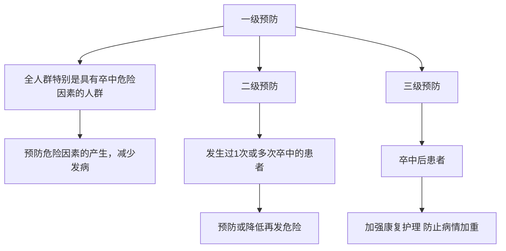
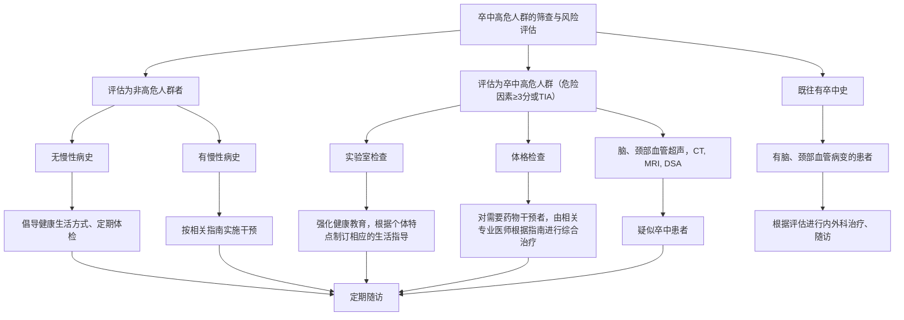

# 卒中筛查与防治技术规范

国家卫生和计划生育委员会脑卒中筛查与防治工程委员会

卒中是一组急性脑循环障碍所致的局限或全面性脑功能缺损综合征，包括缺血性和出血性卒中两大类。缺血性卒中即脑梗死；出血性卒中包括脑出血和蛛网膜下腔出血。卒中具有发病率高、致残率高、病死率高和复发率高等特点。2008年公布的我国居民第3次死因抽样调查结果显示，脑血管病已成为我国国民第一位的死亡原因。卒中严重危害着人民群众的生命健康和生活质量，给患者及其家庭和社会带来沉重的负担，已经成为我国重大的公共卫生问题。

卒中危险因素非常复杂，除年龄和遗传因素等不可干预者外。在可干预危险因素中，吸烟、饮酒过量、缺乏体力活动等不健康生活方式以及高血压、糖尿病、血脂异常、心房颤动、高同型半胱氨酸血症等疾病都与卒中的关系尤为密切。世界各国卒中防控的经验表明，针对卒中危险因素，采取有效的一、二、三级预防措施，可以避免大多数卒中的发生，控制已患病者的病情，降低卒中的发病率、致残率和病死率。短暂性脑缺血发作(TIA)是缺血性卒中发生的前兆，也是卒中筛查与防治的重点之一。卒中筛查与防治要“关口前移，重心下沉”，建立并完善相关工作体系，普及适宜技术，做到早发现与及时干预。

## 一、概述

### (一) 卒中预防的基本策略(图 1)

一级预防:指发病前预防。指导国民培养良好健康的生活方式,预防危险因素的产生;特别是针对卒中高危人群,通过早期改善不健康生活方式,及早控制危险因素。  
二级预防:针对发生过1次或多次卒中的患者,探寻病因和控制可干预危险因素,预防或降低卒中再发危险。  
三级预防:针对卒中患者加强治疗和康复护理,防止病情加重,预防或减轻残疾程度,促进功能恢复。

flowchart

图1 卒中三级预防策略

### （二）组织与管理

DOI:10.3760/cma.j.issn.1006-7876.2014.03.014

通信作者: 王陇德, 100044 北京, 国家卫生和计划生育委员会 (Email: wsbnfw@vip.163.com)

在各级卫生行政部门领导下，省、地市、县区医疗机构、社区卫生服务中心和乡镇卫生院要广泛开展卒中的防治，进行高危人群的筛查、早期规范干预和管理。

医疗机构应探索卒中高危人群筛查与防治工作一体化连续性服务模式和综合性防治措施，形成跨学科防治协作机制，为相关专业多学科协作和人才队伍建设提供持续的、必要的条件和政策支持。有条件的医疗机构可设立卒中筛查防治门诊和卒中病区(单元)。各级医疗机构应积极联合，逐步建立区域内卒中筛查与防治协作服务网，实行双向转诊协作机制，做到早预防、早发现、早诊断、早治疗。

## 二、健康指导

### （一）生活方式干预

1. 戒烟:(1)吸烟者应戒烟,不吸烟者也应避免被动吸烟;(2)动员全社会人员参与,在社区人群中采用综合性控烟措施对吸烟者进行干预,包括:戒烟咨询、心理辅导、尼古丁替代疗法、口服戒烟药物等;(3)继续加强宣传教育,提高公众对主动与被动吸烟危害性的认识。  
2. 控制体重:(1)劝说超重者和肥胖者通过采取合理饮食、增加体力活动等措施减轻体重,降低卒中发病危险;(2)体重指数正常值为 $18.5\sim23.9\ kg/m^{2}$ , $24.0\sim27.9\ kg/m^{2}$ 为超重, $\geqslant28.0\ kg/m^{2}$ 为肥胖。  
3. 合理饮食: 提倡多吃蔬菜、水果, 适量进食谷类、牛奶、豆类和肉类等, 使能量的摄入和消耗达到平衡; 限制红肉的摄入量, 减少饱和脂肪 (<10% 总热量) 和胆固醇 (<300 mg/d) 的摄入量; 限制食盐摄入量 (<6 g/d); 不喝或尽量少喝含糖饮料。  
4. 体力活动:采用适宜个体的体力活动。(1)中老年人和高血压患者进行体力活动之前,应考虑进行心脏应激检查,全方位考虑运动强度,制订个体化运动方案;(2)成年人每周≥3次适度的体育活动,每次时间≥30 min(如快走、慢跑或其他有氧代谢运动等)。  
5. 限制饮酒: 不饮酒; 饮酒者应适度, 一般男性每日摄入酒精不超过 25 g, 女性减半, 不酗酒。

### （二）定期体检

40 岁以上人群应定期体检,一般每年检查 1 次为宜。了解心脑血管有无异常;监测血压、血糖和血脂水平,高危个体应进行颅内外血管评估,发现异常应积极干预。对于有卒中家族史的人群,应及时接受遗传咨询,评估卒中风险。

### (三)重视卒中早期症状

卒中早期症状:(1)突发一侧面部或肢体麻木无力,口角歪斜流涎;(2)突发视力模糊或失明;(3)突发语言表达或理解困难；(4)突发严重的不明原因头痛、呕吐；(5)突发不明原因的头晕、走路不稳或突然跌倒、遗忘或记忆障碍，尤其是伴有1\~4项中任一症状时。出现卒中早期症状，不论时间长短应及时就医，以缩短入院前的延误时间。

## 三、卒中高危人群筛查

### (一)卒中风险筛查评估

针对 40 岁以上人群,依据以下 8 项危险因素进行卒中风险筛查评估(每一项 1 分)。(1)高血压病史( $\geqslant$ 140/90 mmHg, 1 mmHg = 0.133 kPa)或正在服用降压药;(2)心房颤动和(或)心瓣膜病等心脏病;(3)吸烟;(4)血脂异常;(5)糖尿病;(6)很少进行体育活动;(7)明显超重或肥胖(体重指数 $\geqslant$ 26 kg/m $^{2}$ );(8)有卒中家族史。

卒中风险筛查评估≥3分的高危人群,或既往有缺血性卒中患者和(或)TIA病史者,依据个体危险程度不同,选择性进行相关实验室和影像学检查,并对其进行生活方式和适宜性技术干预。

### (二)卒中高危人群筛查与干预流程(图2)

### (三)筛查方法与步骤

1. 医师接诊、病史采集、体格检查: 主要询问有无卒中或 TIA 的症状, 既往有无高血压、血脂异常、糖尿病及心脑血管病史、吸烟饮酒史、饮食生活习惯、家族性心脑血管病史等, 测身高、体重、腹围、双上肢血压、听颈部血管杂音及神经系统体格检查等。  
2. 实验室检查:根据病史、体征及既往有异常指标需进一步检查者,应有针对性地进行实验室检查,包括血糖、血脂、同型半胱氨酸等。  
3. 脑、颈部血管超声: 脑、颈部血管超声包括颈部动脉超声和经颅多普勒超声。脑、颈部血管超声检查通常无禁忌证, 能够判断脑、颈部血管狭窄病变的程度和范围, 为临床干预提供重要信息。执业人员应经过血管超声筛查知识和技术的专门培训。  
4. 其他筛查手段: 包括心电图、超声心动图等。如脑、

flowchart

图 2 卒中高危人群筛查与干预流程

颈部血管超声发现有血管病变,可选择性行 CTA、MRA、DSA 等检查。

## 四、内科干预

针对卒中患者及高危人群,采取群体预防和个体干预的措施,及时对卒中危险因素进行干预。

### (一) 血压管理

定期监测血压,既往有高血压病史者应该接受脑血管评估,根据是否有脑血管狭窄或动脉瘤等脑血管病变合理控制血压。一般将血压控制在 140/90 mmHg 以下 $^{[1]}$ 。对高于目标血压的患者,应早期使用降压药物,使血压达标。

### (二)血糖管理

有卒中病史和(或)TIA或卒中高危人群,应进行糖尿病筛查,建议定期检测空腹血糖,必要时做糖耐量试验或测定糖化血红蛋白。糖尿病患者应改变生活方式,控制饮食,加强体育锻炼。2\~3个月后血糖控制仍不满意者,可选用口服降糖药或使用胰岛素治疗。糖尿病患者的血糖控制目标为糖化血红蛋白<7%,但必须遵循个体化原则 $^{[2]}$ 。对于年轻、病程短及无并发症的患者,在避免低血糖的前提下,尽可能使糖化血红蛋白接近正常水平;对于老年人、有严重或频发低血糖史以及有严重并发症的患者,控制目标可适当放宽。

### (三)血脂调控

定期检查血脂,异常者依据其危险分层决定血脂控制的目标值。首先改变生活方式,无效者采用药物治疗。药物选择应根据患者的血脂水平以及血脂异常的分型决定。

伴有血脂异常的缺血性卒中和(或)TIA患者,应进行生活方式干预及药物治疗。根据危险分层使用他汀类药物,对伴有多种危险因素、有颅内外大动脉粥样硬化性易损斑块或动脉源性栓塞证据者,低密度脂蛋白胆固醇正常值<2.07 mmol/L;其他患者低密度脂蛋白胆固醇<2.59 mmol/L $^{[3]}$ 。他汀类药物治疗前及治疗中,应注意肌痛等临床症状,监测

丙氨酸氨基转移酶和磷酸肌酸激酶变化。对于脑出血病史或脑出血高风险人群应权衡风险和获益，谨慎使用他汀类药物。

### (四)急性期溶栓治疗

溶栓治疗应严格遵循溶栓时间窗及适应证治疗；在治疗时间窗内，首先考虑静脉溶栓，如不适合，经严格评估后可进行动脉溶栓；溶栓治疗须在具备溶栓条件的医院进行，医院对溶栓进行组织化管理，建立绿色通道，加强多学科合作，缩短溶栓治疗的时间延误；溶栓须由具有医师资质且接受过专业培训的医务人员严格按照指南规范实施$^{[4]}$。

1. 静脉溶栓适应证: 急性缺血性卒中患者发病 4.5 h 内, 推荐静脉应用重组组织型纤溶酶原激活剂溶栓治疗。发病

6 h 内的缺血性卒中患者, 如不能使用重组组织型纤溶酶原激活剂可考虑静脉给予尿激酶。

2. 动脉溶栓: 应符合以下条件:(1)临床症状符合缺血性卒中的诊断、血管造影显示闭塞特点符合动脉粥样硬化性动脉病变;(2)前循环卒中治疗时间窗在6 h以内;后循环缺血治疗时间窗为12 h内;(3)靶血管为大血管闭塞(基底动脉、椎动脉、颈内动脉或大脑中动脉M1及M2段等)。

### (五)抗血小板治疗

1. 推荐卒中高风险患者(根据 Framingham 量表 10 年心脑血管事件风险 $\geqslant 6\% \sim 10\%$ ) 使用阿司匹林进行一级预防 $^{[5]}$ 。  
2. 非心源性缺血性卒中和(或)TIA患者的二级预防中要加强科学的危险分层及分层管理(Essen或ABCD $^{2}$ 评分) $^{[6]}$ 。除少数情况需要抗凝治疗,大多数情况均建议给予抗血小板药物。抗血小板药物的选择以单药治疗为主,阿司匹林、氯吡格雷均可以作为首选药物。对于有急性冠状动脉疾病或近期有支架成形术的患者,推荐联合应用阿司匹林和氯吡格雷 $^{[7]}$ 。  
3. 高血压患者长期应用阿司匹林应注意脑出血的风险,应在血压控制稳定后(<150/90 mmHg)应用。

### (六)抗凝治疗

1. 对于心房颤动不合并缺血性卒中和(或)TIA的患者,根据危险分层、出血风险评估和患者意愿,结合当地医院是否具备抗凝监测条件,决定是否进行抗凝治疗。如有抗凝适应证,应常规进行抗凝治疗。使用华法林需要监测凝血酶原时间国际标准化比值,新一代抗凝药物沙班类有不用监测凝血酶原时间国际标准化比值的优点。  
2. 对于既往有阵发性或持续性心房颤动的缺血性卒中和(或)TIA病史的患者,推荐使用华法林进行抗凝治疗,以预防再发的血栓栓塞事件;对于非心源性缺血性卒中和(或)TIA患者,某些特殊情况下可考虑给予抗凝治疗,如主动脉弓粥样硬化斑块、基底动脉梭形动脉瘤、颈动脉夹层、卵圆孔未闭伴深静脉血栓形成或房间隔瘤等。  
3. 对于脑静脉系统血栓患者,如无禁忌证应尽早进行抗凝治疗。

### (七)中医药治疗

中医药治疗强调以辨证论治为原则,根据卒中病程各阶段的证候动态变化遣方用药。

### (八)其他

1. 降纤治疗: 对不适合溶栓并经过严格筛选的脑梗死患者, 特别是高纤维蛋白血症者可选用降纤治疗。  
2. 扩容治疗: 对一般缺血性卒中患者不推荐扩容。对低血压或脑血流低灌注所致的急性脑梗死如分水岭梗死患者可考虑扩容治疗, 但应注意心功能状况。

## 五、外科干预

### (一)颈动脉内膜剥脱术(CEA)

CEA 通过外科手段使管腔重新通畅,并防止栓子脱落及血栓形成,从而预防卒中发生 $^{[8]}$ 。

1. CEA 手术适应证: (1) 在 6 个月内有过非致残性缺血性卒中和(或) TIA 的中低危外科手术风险患者, 经影像学检查发现同侧颈内动脉狭窄程度 >50%, 并经过 DSA 证实, 预计围手术期不良事件发生率 <6%, 应首选 CEA。(2) 无症状患者, 颈动脉狭窄程度 ≥70%, 须结合患者的合并症情况、预期寿命及其他个人因素来讨论分析手术的利弊, 谨慎实施手术。(3) 高龄患者血管条件不适合介入治疗的, 首选 CEA。  
2. CEA 应遵循的原则: (1) 对于无症状颈动脉狭窄患者要全面评估卒中危险因素, 综合处理。(2) 对于缺血性卒中和(或) TIA 患者, 如果没有早期血管重建术的禁忌证, 应尽早干预。(3) 围手术期应给予合理的抗血小板治疗, 术前术后建议合理应用他汀类药物。(4) 围手术期依据个体差异控制血压, 在术前和术后 24 h 内记录神经系统检查结果。(5) 建议 CEA 术后 1 个月、6 个月、每年进行无创性影像学检查评估, 包括颅内外动脉功能情况。

## (二)血管搭桥术

1. 血管搭桥术适应证:(1) TIA 或可逆性神经功能障碍频繁发作,遵循指南内科治疗无效,导管血管造影证实有相关血管狭窄≥70%,不适宜行血管内治疗或经血管内治疗后复发,无法再次行血管内治疗者。(2) 慢性闭塞性脑血管病,如动脉粥样硬化性闭塞,脑底动脉闭塞症(烟雾病),各类炎症性闭塞,或其他原因导致颈动脉闭塞的慢性期,如慢性外伤性颈动脉闭塞。(3) 动脉瘤或动静脉瘘等手术行动脉孤立术,需临时或永久阻断血管者。  
2. 血管搭桥术应遵循的原则:(1)对于有症状的患者拟行血管重建前,建议行全脑血管造影了解病变局部及侧支循环代偿情况;行脑血流动力学评价、了解存在的血流动力学障碍情况。(2)术前需考虑受体血管与供体血管管径及血流量的匹配;如无合适原位供体血管,可考虑移植血管旁路手术。(3)严重高血压合并广泛脑小血管病变者,不推荐行搭桥术。(4)有严重的心、肝、肾、肺功能不全,严重糖尿病及癌症等全身其他疾病,经严格评估后不宜手术。(5)对于已行动脉血管搭桥的患者,建议定期随诊。

### (三)动脉瘤夹闭术

1. 动脉瘤手术夹闭适应证:(1)低风险病例,如年轻患者,位于前循环的小动脉瘤首选夹闭术。(2)症状性动脉瘤直径>7 mm,或年龄<70岁的健康者偶然发现的直径>10 mm的动脉瘤,无明显禁忌证,为降低卒中风险应该给予处理。(3)既往有蛛网膜下腔出血病史的患者应及时处理。(4)存在其他危险因素(包括动脉瘤的结构、生长情况以及基因易患性和家族易患性等)者应积极干预 $^{[9]}$ 。  
2. 动脉瘤手术夹闭应遵循的原则:(1)巨大动脉瘤及瘤颈瘤体比较大的动脉瘤应综合考虑外科治疗途径。(2)偶然发现的直径<5 mm未破裂动脉瘤可采取保守治疗。

### (四) 血肿清除术

患者处于脑疝早期或前期,特别是小脑出血伴神经功能恶化,脑干受压和(或)脑室梗阻致脑积水者,经积极内科治疗无效应尽快手术清除血肿。CT示大面积脑出血和水肿，中线结构侧移≥5 mm，基底池受压 $^{[10]}$ 。

应根据患者意识、出血量、出血部位、病情进展、年龄及全身综合情况等因素确定是否手术。

### (五)脑室穿刺引流术

脑出血破入脑室、脑积水、伴神经功能继续恶化或脑干受压时可考虑行脑室穿刺引流术。在出现脑室内出血时可以同时使用溶栓药物作为脑室导管的辅助手段 $^{[11]}$ 。

### (六)其他

1. 微创治疗: 根据适应证严格选择病例。微创治疗包括立体定向穿刺或内镜血肿清除术。(1) 适用于各部位出血, 特别是脑深部出血; (2) 脑室引流对出血铸型者效果不佳, 可首选微创治疗; (3) 对于出血量较多的血肿应慎用微创治疗。  
2. 颅内压监测和治疗:(1)颅内出血患者格拉斯哥昏迷量表评分 $\leqslant8$ 分,出现小脑幕疝的临床表现、严重脑室内出血、脑积水,建议在脑血流自动调节的基础上保持脑灌注压在50\~70 mmHg;(2)意识水平下降的脑积水患者可行脑室引流。

## 六、介入干预治疗

### (一)介入干预治疗适应证

1. 颈动脉支架术(CAS):(1)症状性颈动脉狭窄患者,如无创性影像检测发现同侧颈动脉狭窄程度>70%或经导管血管造影显示狭窄程度>50%,血管内操作中低危险者,CAS可作为CEA的候选措施。(2)无症状颈动脉狭窄患者,通过导管血管造影提示狭窄程度>70%,当CEA手术风险高但血管内操作中低危患者,首选CAS治疗。(3)对于颈部条件不适合CEA,或CEA难以到达病变部位的症状性重度狭窄患者,某些肌纤维发育不良患者、大动脉炎稳定期有局限性狭窄患者、CEA术后再狭窄患者以及放疗后颈动脉重度狭窄患者,可根据病情首选CAS治疗 $^{[12]}$ 。

2. 椎动脉起始段狭窄: 椎-基底动脉系统缺血症状, 抗凝或抗血小板聚集治疗无效, 血管造影显示一侧椎动脉开口处狭窄程度 >70%, 另外一侧发育不良或完全闭塞。

3. 锁骨下动脉狭窄:(1)血管造影证实狭窄>70%,血管造影或血管超声证实有“盗血”现象,具有明确椎-基底动脉系统缺血症状。(2)血管造影证实狭窄>70%,具有明确患侧上肢缺血症状。

4. 颅内动脉介入治疗: (1) 症状性颅内动脉狭窄, 血管造影证实狭窄 >70%, 规范药物治疗无效的患者。(2) 缺血性卒中急性动脉溶栓后残余狭窄。(3) 颅内动脉瘤的介入治疗: 当外科干预风险很大时, 如高龄或者伴发严重内科疾病的患者、解剖位置不利于手术(如后循环的基底动脉尖动脉瘤)的患者, 可进行血管内栓塞术; 对于复杂的动脉瘤, 应采取联合治疗, 如动脉搭桥术加邻近的责任血管栓塞术 $^{[13]}$ 。

### (二)介入干预治疗应遵循的原则

介入干预治疗须由具有资质的医师接受神经介入培训后，严格按照指南操作规范进行。

1. 推荐动脉支架围手术期进行规范的抗血小板治疗，治疗周期取决于支架材料类型和目标血管。  
2. 严格控制动脉支架实施中的危险因素,积极进行合并症的治疗。  
3. 推荐术前和术后 24 h 内记录神经系统检查结果。  
4. 建议术后 1 个月、6 个月、每年进行影像学随诊，包括对侧血管及全脑血管情况。

## 七、卒中康复与护理

### (一)卒中康复

卒中康复是经循证医学证实为降低致残率的有效方法，是卒中组织化管理中不可或缺的关键环节 $^{[14]}$ 。

1. 卒中功能障碍的康复:(1)运动功能障碍:肌力训练:适当的肌力强化训练,可结合肌电生物反馈疗法、功能电刺激治疗。痉挛的防治:全身性肌肉痉挛患者,建议使用口服抗痉挛药物;局部肌肉痉挛患者,建议使用肉毒毒素局部注射。(2)感觉障碍:感觉障碍患者可采用特定感觉和感觉关联性训练以提高其感觉能力。(3)认知障碍和情绪障碍:推荐认知训练来改善认知功能障碍;心理治疗来改善情绪障碍。并可以选择合适的药物进行治疗。(4)语言交流障碍:对语音和语义障碍进行针对性康复训练,以提高语言交流能力。(5)吞咽障碍:吞咽障碍的治疗与管理最终目的是使患者能够安全、充分、独立地摄取足够营养及水分。(6)尿、便障碍:在膀胱、直肠功能评价基础上,为尿、便障碍患者制订和执行膀胱、肠道训练计划。  
2. 卒中后继发障碍的康复: 骨质疏松、压疮、关节挛缩、肩痛、肩手综合征、肩关节半脱位等是卒中后常见的继发障碍, 针对不同障碍进行预防和康复治疗。  
3. 日常生活能力和生活质量的提高: 持续功能训练、家庭和社会支持是提高日常生活能力和生活质量的必要条件。  
4. 其他康复措施: 康复工程、手术矫形、中医疗法是卒中后常用康复技术。

### (二)卒中护理

卒中护理在卒中治疗过程中起着非常重要的作用,包括以下几个方面:

1. 肢体瘫痪的护理:防止坠床、跌倒、烫伤;注意良肢位摆放;预防压疮、下肢深静脉血栓、肺部感染等并发症。  
2. 意识障碍的护理: 监测生命体征、意识状态; 保持呼吸道通畅; 维持水与电解质平衡、营养支持; 维持正常尿、便功能。  
3. 吞咽障碍的护理: 根据吞咽障碍程度决定经口进食或鼻饲喂养。  
4. 心理和情感障碍的护理: 通过心理疏导解除患者心理压力和不良情绪。  
5. 语言交流障碍的护理:采用交流板和肢体语言进行有效交流。  
6. 预防肺部感染的护理: 维持肺与呼吸道功能, 促进痰液排出; 正确喂养, 预防误吸; 有关器具消毒、口腔护理。  
7. 压疮的护理: 衣物平整、体位变化、气垫床使用等可

预防压疮；对已出现压疮者进行评级、换药。

8. 下肢深静脉血栓的护理: 早期下床活动和床上主动肢体运动是有效的预防措施; 已出现下肢深静脉血栓者, 应抬高患肢、制动。  
9. 大便管理: 每日给予充足的水分, 可增加粗纤维食物, 养成每日或隔日排便习惯。  
10. 泌尿系统的护理: 保持尿道口及会阴部清洁; 锻炼膀胱括约肌功能; 定期更换导尿管与引流袋。

## 参考文献

[1] 中国高血压防治指南修订委员会. 中国高血压防治指南 2010 [J]. 中华心血管病杂志, 2011, 39: 579-616.  
[2] 中华医学会糖尿病学分会，中国2型糖尿病防治指南制订委员会. 中国2型糖尿病防治指南2010年版[M]. 北京：北京大学医学出版社，2011:9.  
[3] 中国成人血脂异常防治指南制订联合委员会. 中国成人血脂异常防治指南[J]. 中华心血管病杂志,2007,35:390-427.  
[4] 中华医学会神经病学分会脑血管病学组急性缺血性脑卒中诊治指南撰写组. 中国急性缺血性脑卒中诊治指南 2010 [J]. 中华神经科杂志, 2010, 43: 146-153.  
[5] 中华医学会神经病学分会脑血管病学组“卒中一级预防指南”撰写组．中国卒中一级预防指南 2010 [J]. 中华神经科杂志，2011,44:282-288.  
[6] 中华医学会神经病学分会脑血管病学“缺血性脑卒中二级预防指南”撰写组. 中国缺血性脑卒中和短暂性脑缺血发作二级预防指南 2010[J]. 中华神经科杂志, 2010, 43: 154-160.  
[7] Furie KL, Kasner SE, Adams RJ, et al. Guidelines for the prevention of stroke in patients with stroke or transient ischemic attack: a guideline for healthcare professionals from the american heart association/american stroke association [J]. Stroke, 2011, 42: 227-276.  
[8] Komotar RJ, Mocco J, Solomon RA. Guidelines for the surgical treatment of unruptured intracranial aneurysms: the first annual J. Lawrence pool memorial research symposium--controversies in the management of cerebral aneurysms [J]. Neurosurgery, 2008, 62: 183-193, discussion 193-194.  
[9] 王忠诚. 王忠诚神经外科学 [M]. 武汉: 湖北科学技术出版社, 2005: 11.  
[10] Morgenstern LB, Hemphill JC 3rd, Anderson C, et al. Guidelines for the management of spontaneous intracerebral hemorrhage: A guideline for healthcare professionals from the american heart association/american stroke association. Stroke, 2010, 41:2108-2129.  
[11] Bederson JB, Connolly ES Jr, Batjer HH, et al. Guidelines for the management of aneurysmal subarachnoid hemorrhage: A statement for healthcare professionals from a special writing group of the stroke council, american heart association [J]. Stroke, 2009, 40: 994-1025.  
[12] 中华医学会神经病学分会脑血管病学组缺血性脑血管病血管内介入诊疗指南撰写组．中国缺血性脑血管病血管内介入诊疗指南[J].中华神经科杂志，2011,44:862-868.  
[13] Brott TG, Halperin JL, Abbara S, et al. 2011 ASA/ACCF/AHA/AANN/AANS/ACR/ASNR/CNS/SAIP/SCAI/SIR/SNIS/SVM/SVS guideline on the management of patients with extracranial carotid and vertebral artery disease: executive summary [J]. Stroke, 2011, 42: e420-463.  
[14] 中华医学会神经病学分会脑血管病学组、神经康复学组．中国卒中康复治疗指南简化版[J].中华神经科杂志,2012,45:201-206.

