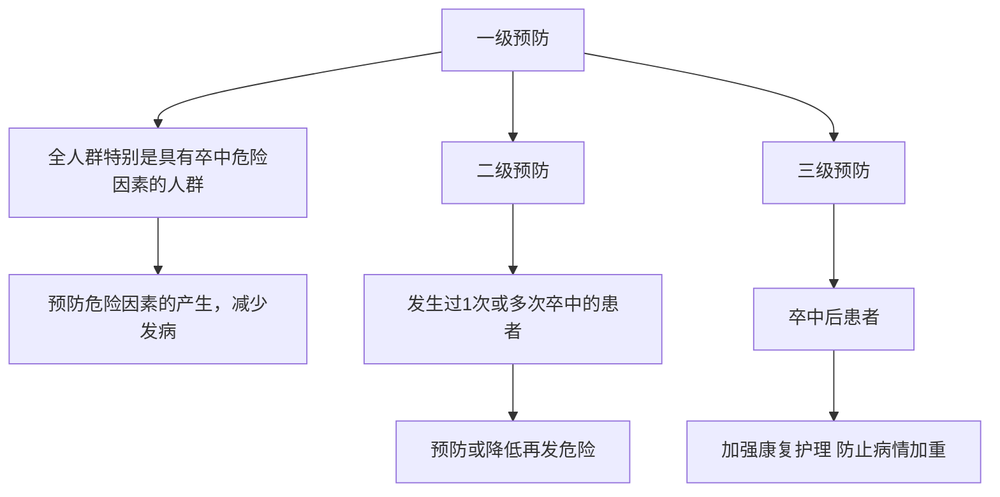

1.有图片或者mermaid的情况

flowchart

2.对特定公式的转换
体重指数正常值为 $18.5\sim23.9\ kg/m^{2}$ , $24.0\sim27.9\ kg/m^{2}$ 为超重, $\geqslant28.0\ kg/m^{2}$ 为肥胖。  
(1)高血压病史( $\geqslant$ 140/90 mmHg, 1 mmHg = 0.133 kPa)或正在服用降压药;(2)心房颤动和(或)心瓣膜病等心脏病;(3)吸烟;(4)血脂异常;(5)糖尿病;(6)很少进行体育活动;(7)明显超重或肥胖(体重指数 $\geqslant$ 26 kg/m $^{2}$ );(8)有卒中家族史。
$37.6^\circ\mathrm{C}$

3.摘要和关键词 （对论文格式的处理）双栏格式的处理
【摘要】目的 本指南旨在为自发性脑出血的诊断和治疗提供最新的全面推荐意见。方法利用 PubMed 进行规范化文献检索，检索时间至2013年8月底。撰写委员会成员通过远程电信会议讨论指南内容及推荐意见，采用美国心脏协会/美国卒中协会的疗效确定性水平和证据分级方案对推荐意见进行分级。由6位同行评议专家以及卒中委员会科学声明监督委员会和卒中委员会领导委员会成员对指南草案进行发表前审阅。结果 本文为急性脑出血患者的医疗诊治提供了循证指南，重点包括诊断、凝血功能障碍和血压管理、继发性脑损伤防治、颅内压控制、外科治疗的作用、转归预测、康复、二级预防以及将来需要考虑的问题。本指南已纳入最新的3期临床试验结果。结论 脑出血是一种需要进行早期积极救治的危重疾病。本指南为脑出血患者的目标导向治疗提供了一个框架。

【关键词】 美国心脏协会科学声明；血压；凝血功能障碍；诊断；脑出血；脑室出血；外科手术；治疗