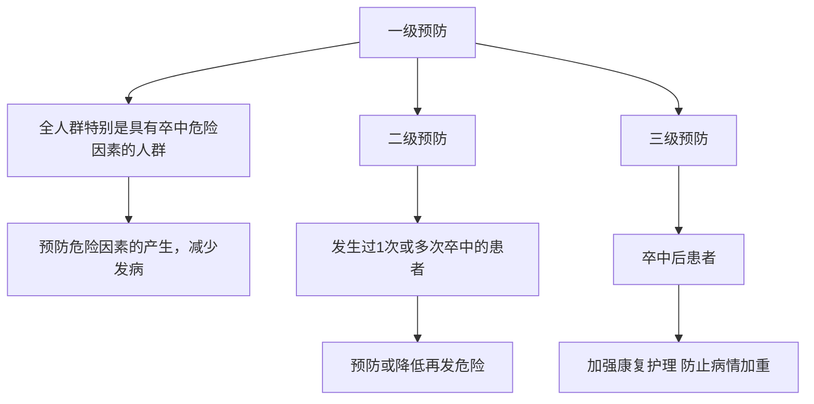

1.有图片或者mermaid的情况

flowchart

2.对特定公式的转换
体重指数正常值为 $18.5\sim23.9\ kg/m^{2}$ , $24.0\sim27.9\ kg/m^{2}$ 为超重, $\geqslant28.0\ kg/m^{2}$ 为肥胖。  
(1)高血压病史( $\geqslant$ 140/90 mmHg, 1 mmHg = 0.133 kPa)或正在服用降压药;(2)心房颤动和(或)心瓣膜病等心脏病;(3)吸烟;(4)血脂异常;(5)糖尿病;(6)很少进行体育活动;(7)明显超重或肥胖(体重指数 $\geqslant$ 26 kg/m $^{2}$ );(8)有卒中家族史。